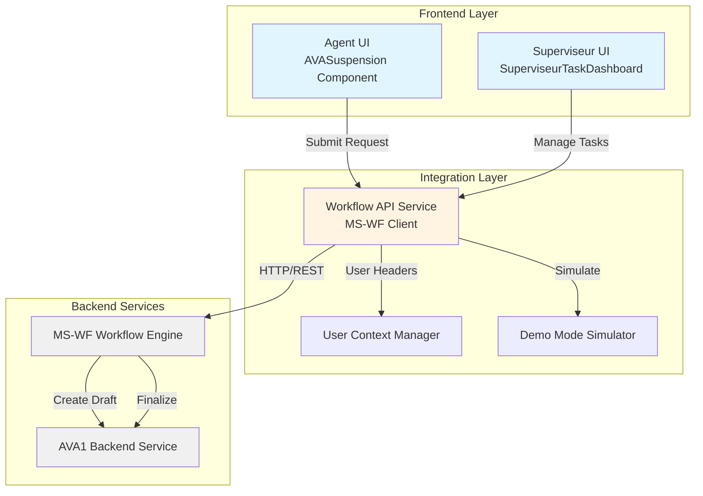
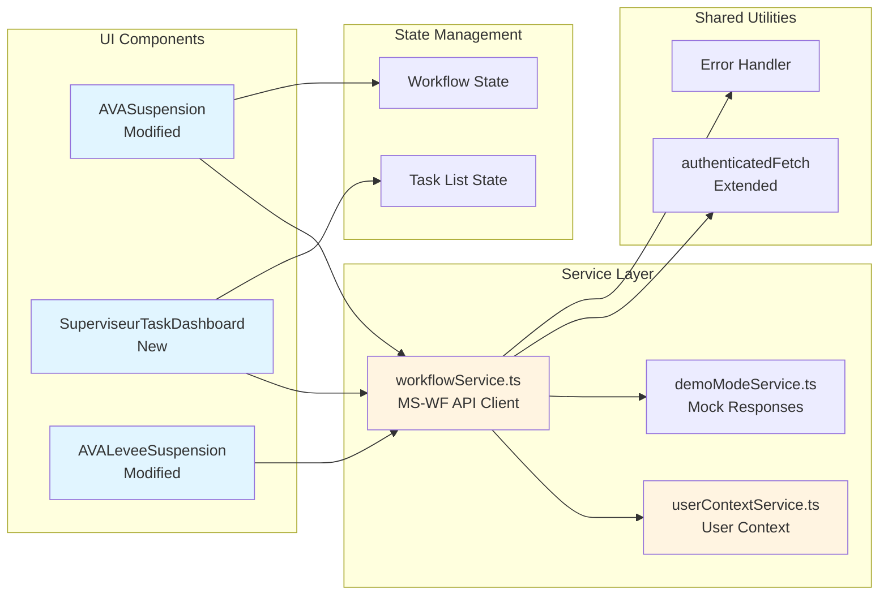
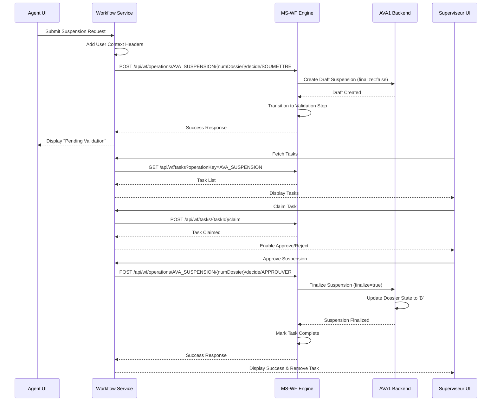
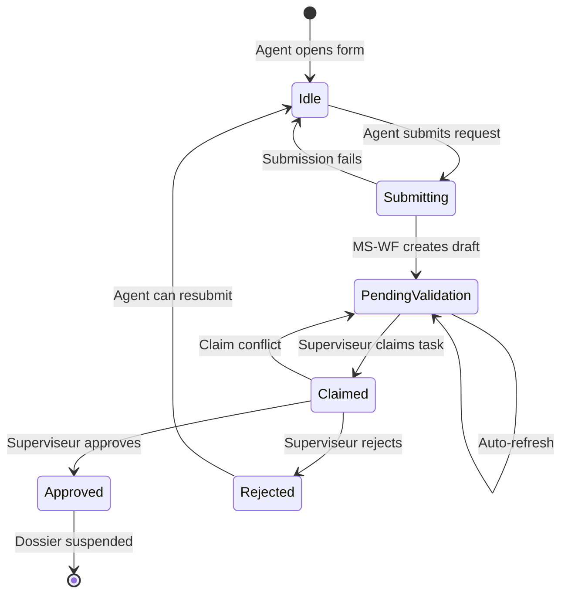
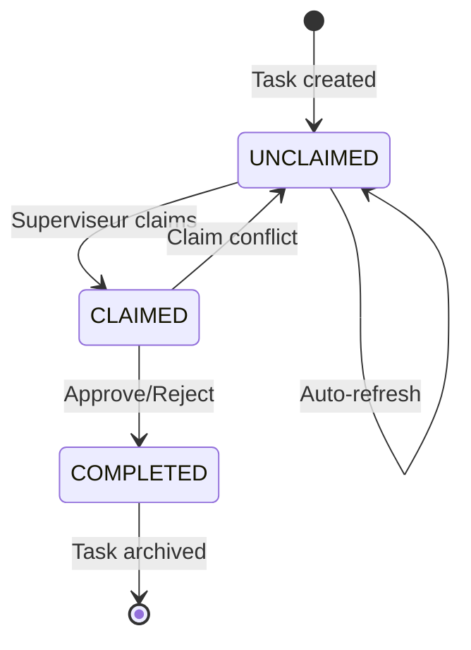

# Design Document: AVA Suspension Workflow Integration

## Overview

### Purpose

This design document specifies the technical architecture for migrating the AVA suspension system from direct backend service calls (AVA1) to a centralized workflow engine (MS-WF). The integration implements a two-step workflow with separation of duties between Agent and Superviseur roles, enabling proper validation, audit trails, and task management for suspension operations.

### Background

The current AVA suspension system allows agents to directly suspend or lift suspension on AVA dossiers through simple API calls to the AVA1 backend. This approach lacks validation workflows, audit trails, and separation of duties. The new system introduces MS-WF as a centralized workflow orchestrator that manages multi-step business processes with role-based task assignment and approval workflows.

### Goals

1. **Workflow Integration**: Integrate MS-WF as the orchestration layer for suspension operations
2. **Separation of Duties**: Implement Agent (submission) and Superviseur (validation) role separation
3. **Task Management**: Provide task dashboard for Superviseurs to claim, approve, and reject requests
4. **Backward Compatibility**: Maintain existing UI/UX patterns and component structure
5. **Demo Mode Support**: Enable testing without live MS-WF backend
6. **Audit Trail**: Log all workflow operations for compliance and troubleshooting

### Scope

**In Scope:**
- Agent suspension request submission workflow
- Superviseur task dashboard with filtering and sorting
- Task claiming mechanism
- Approval and rejection workflows
- User context header management
- Error handling and user feedback
- Demo mode simulation
- Suspension lift workflow integration

**Out of Scope:**
- MS-WF backend implementation (assumed to exist)
- AVA1 backend modifications
- Authentication system changes
- Real-time WebSocket notifications (using polling instead)
- Mobile-specific UI adaptations


## Architecture

### System Context



### Component Architecture



### Data Flow: Suspension Request Workflow



### Technology Stack

**Frontend:**
- React 18+ with TypeScript
- shadcn/ui component library
- Sonner for toast notifications
- Lucide React for icons

**State Management:**
- React useState/useEffect hooks
- Session storage for filter persistence
- Polling-based real-time updates (30-second interval)

**API Communication:**
- Extended authenticatedFetch utility
- REST API with JSON payloads
- User context headers (X-User-Id, X-Role-Code, X-Org-Node-Id)

**Development Tools:**
- Demo mode for offline testing
- Browser console logging
- TypeScript for type safety


## Components and Interfaces

### Modified Component: AVASuspension

**Purpose**: Extend existing suspension component to submit requests through MS-WF instead of direct AVA1 calls.

**Key Changes:**
- Replace direct `/api/suspension/true` call with MS-WF workflow submission
- Add workflow state display (Pending Validation badge)
- Include user context headers in requests
- Handle workflow-specific error responses

**Component Structure:**
```typescript
interface AVASuspensionProps {
  // Existing props maintained for backward compatibility
}

interface SuspensionWorkflowState {
  status: 'idle' | 'submitting' | 'pending_validation' | 'approved' | 'rejected';
  taskId?: string;
  submittedAt?: string;
  submittedBy?: string;
}

export function AVASuspension() {
  // Existing state
  const [dossierSelectionne, setDossierSelectionne] = useState<DossierAVA | null>(null);
  const [suspension, setSuspension] = useState<SuspensionDTO>({...});
  
  // New workflow state
  const [workflowState, setWorkflowState] = useState<SuspensionWorkflowState>({
    status: 'idle'
  });
  
  // Modified submit handler
  const handleSubmit = async () => {
    // Validate form
    if (!validateForm()) return;
    
    // Call workflow service instead of direct API
    const result = await workflowService.submitSuspension({
      numeroDossier: suspension.numeroDossier,
      motifSuspension: suspension.motifSuspension,
      dateSuspension: suspension.dateSuspension,
      observations: suspension.observations
    });
    
    if (result.success) {
      setWorkflowState({ status: 'pending_validation', ...result.data });
      toast.success('Demande de suspension soumise pour validation');
    } else {
      handleWorkflowError(result.error);
    }
  };
  
  // Render with workflow state badge
  return (
    <div>
      {/* Existing UI */}
      {workflowState.status === 'pending_validation' && (
        <Badge variant="warning">En attente de validation</Badge>
      )}
      {/* ... */}
    </div>
  );
}
```

### New Component: SuperviseurTaskDashboard

**Purpose**: Provide Superviseurs with a dashboard to view, claim, approve, and reject suspension validation tasks.

**Component Structure:**
```typescript
interface WorkflowTask {
  taskId: string;
  businessKey: string; // numDossier
  operationKey: 'AVA_SUSPENSION' | 'AVA_LEVEE_SUSPENSION';
  assignee: string | null;
  createdAt: string;
  createdBy: string;
  status: 'UNCLAIMED' | 'CLAIMED' | 'COMPLETED';
  payload: {
    numeroDossier: string;
    motifSuspension?: string;
    dateSuspension?: string;
    observations?: string;
  };
}

interface TaskFilters {
  businessKey: string;
  status: 'ALL' | 'UNCLAIMED' | 'CLAIMED';
  dateFrom: string;
  dateTo: string;
  operationType: 'ALL' | 'AVA_SUSPENSION' | 'AVA_LEVEE_SUSPENSION';
}

interface TaskSort {
  column: 'createdAt' | 'businessKey';
  direction: 'asc' | 'desc';
}

export function SuperviseurTaskDashboard() {
  const [tasks, setTasks] = useState<WorkflowTask[]>([]);
  const [filteredTasks, setFilteredTasks] = useState<WorkflowTask[]>([]);
  const [filters, setFilters] = useState<TaskFilters>({
    businessKey: '',
    status: 'ALL',
    dateFrom: '',
    dateTo: '',
    operationType: 'ALL'
  });
  const [sort, setSort] = useState<TaskSort>({
    column: 'createdAt',
    direction: 'desc'
  });
  const [loading, setLoading] = useState(false);
  const [refreshInterval, setRefreshInterval] = useState<NodeJS.Timeout | null>(null);
  
  // Fetch tasks on mount and set up polling
  useEffect(() => {
    fetchTasks();
    const interval = setInterval(fetchTasks, 30000); // 30-second refresh
    setRefreshInterval(interval);
    
    return () => {
      if (interval) clearInterval(interval);
    };
  }, []);
  
  // Apply filters and sorting
  useEffect(() => {
    let filtered = [...tasks];
    
    // Apply filters
    if (filters.businessKey) {
      filtered = filtered.filter(t => 
        t.businessKey.includes(filters.businessKey)
      );
    }
    
    if (filters.status !== 'ALL') {
      filtered = filtered.filter(t => t.status === filters.status);
    }
    
    if (filters.operationType !== 'ALL') {
      filtered = filtered.filter(t => t.operationKey === filters.operationType);
    }
    
    // Apply date range filter
    if (filters.dateFrom) {
      filtered = filtered.filter(t => 
        new Date(t.createdAt) >= new Date(filters.dateFrom)
      );
    }
    
    if (filters.dateTo) {
      filtered = filtered.filter(t => 
        new Date(t.createdAt) <= new Date(filters.dateTo)
      );
    }
    
    // Apply sorting
    filtered.sort((a, b) => {
      const aVal = a[sort.column];
      const bVal = b[sort.column];
      const comparison = aVal > bVal ? 1 : -1;
      return sort.direction === 'asc' ? comparison : -comparison;
    });
    
    setFilteredTasks(filtered);
  }, [tasks, filters, sort]);
  
  const fetchTasks = async () => {
    setLoading(true);
    const result = await workflowService.getTasks({
      operationKey: 'AVA_SUSPENSION'
    });
    
    if (result.success) {
      setTasks(result.data);
    } else {
      toast.error('Erreur lors du chargement des tâches');
    }
    setLoading(false);
  };
  
  const handleClaimTask = async (taskId: string) => {
    const result = await workflowService.claimTask(taskId);
    
    if (result.success) {
      toast.success('Tâche réclamée avec succès');
      fetchTasks(); // Refresh task list
    } else {
      if (result.error?.status === 409) {
        toast.error('Cette tâche a déjà été réclamée par un autre utilisateur');
      } else {
        toast.error(result.error?.message || 'Erreur lors de la réclamation');
      }
      fetchTasks(); // Refresh to show updated state
    }
  };
  
  const handleApproveTask = async (task: WorkflowTask) => {
    const result = await workflowService.approveSuspension(task.businessKey);
    
    if (result.success) {
      toast.success(`Suspension approuvée pour le dossier ${task.businessKey}`);
      fetchTasks(); // Refresh task list
    } else {
      toast.error(result.error?.message || 'Erreur lors de l\'approbation');
    }
  };
  
  const handleRejectTask = async (task: WorkflowTask) => {
    const result = await workflowService.rejectSuspension(task.businessKey);
    
    if (result.success) {
      toast.success(`Suspension rejetée pour le dossier ${task.businessKey}`);
      fetchTasks(); // Refresh task list
    } else {
      toast.error(result.error?.message || 'Erreur lors du rejet');
    }
  };
  
  return (
    <div className="p-6 max-w-7xl mx-auto space-y-6">
      {/* Header */}
      <div className="flex items-center justify-between">
        <div>
          <h1 className="text-2xl font-bold">Validation des Suspensions</h1>
          <p className="text-muted-foreground">
            Gérer les demandes de suspension en attente de validation
          </p>
        </div>
        <Button onClick={fetchTasks} variant="outline">
          <RotateCcw className="w-4 h-4 mr-2" />
          Actualiser
        </Button>
      </div>
      
      {/* Filters Card */}
      <Card>
        <CardHeader>
          <CardTitle>Filtres</CardTitle>
        </CardHeader>
        <CardContent>
          <div className="grid grid-cols-4 gap-4">
            <div>
              <Label>N° Dossier</Label>
              <Input
                value={filters.businessKey}
                onChange={(e) => setFilters({...filters, businessKey: e.target.value})}
                placeholder="Rechercher..."
              />
            </div>
            <div>
              <Label>Statut</Label>
              <Select
                value={filters.status}
                onValueChange={(value) => setFilters({...filters, status: value as any})}
              >
                <SelectTrigger>
                  <SelectValue />
                </SelectTrigger>
                <SelectContent>
                  <SelectItem value="ALL">Tous</SelectItem>
                  <SelectItem value="UNCLAIMED">Non réclamées</SelectItem>
                  <SelectItem value="CLAIMED">Réclamées</SelectItem>
                </SelectContent>
              </Select>
            </div>
            <div>
              <Label>Type d'opération</Label>
              <Select
                value={filters.operationType}
                onValueChange={(value) => setFilters({...filters, operationType: value as any})}
              >
                <SelectTrigger>
                  <SelectValue />
                </SelectTrigger>
                <SelectContent>
                  <SelectItem value="ALL">Tous</SelectItem>
                  <SelectItem value="AVA_SUSPENSION">Suspension</SelectItem>
                  <SelectItem value="AVA_LEVEE_SUSPENSION">Levée</SelectItem>
                </SelectContent>
              </Select>
            </div>
            <div>
              <Label>Date de création</Label>
              <Input
                type="date"
                value={filters.dateFrom}
                onChange={(e) => setFilters({...filters, dateFrom: e.target.value})}
              />
            </div>
          </div>
        </CardContent>
      </Card>
      
      {/* Tasks Table */}
      <Card>
        <CardHeader>
          <CardTitle>
            Tâches en attente ({filteredTasks.length})
          </CardTitle>
        </CardHeader>
        <CardContent>
          {loading ? (
            <div className="text-center py-12">
              <div className="animate-spin rounded-full h-12 w-12 border-b-2 border-primary mx-auto" />
              <p className="text-muted-foreground mt-4">Chargement...</p>
            </div>
          ) : filteredTasks.length === 0 ? (
            <div className="text-center py-12">
              <FileText className="w-12 h-12 mx-auto text-muted-foreground mb-4" />
              <p className="text-muted-foreground">Aucune tâche en attente</p>
            </div>
          ) : (
            <table className="w-full">
              <thead>
                <tr className="border-b">
                  <th className="text-left p-3">Type</th>
                  <th className="text-left p-3">N° Dossier</th>
                  <th className="text-left p-3">Soumis par</th>
                  <th className="text-left p-3">Date de création</th>
                  <th className="text-left p-3">Assigné à</th>
                  <th className="text-left p-3">Statut</th>
                  <th className="text-left p-3">Actions</th>
                </tr>
              </thead>
              <tbody>
                {filteredTasks.map((task) => (
                  <tr key={task.taskId} className="border-b hover:bg-muted/50">
                    <td className="p-3">
                      <Badge variant={task.operationKey === 'AVA_SUSPENSION' ? 'destructive' : 'default'}>
                        {task.operationKey === 'AVA_SUSPENSION' ? 'Suspension' : 'Levée'}
                      </Badge>
                    </td>
                    <td className="p-3 font-medium">{task.businessKey}</td>
                    <td className="p-3 text-sm">{task.createdBy}</td>
                    <td className="p-3 text-sm">
                      {new Date(task.createdAt).toLocaleString('fr-FR')}
                    </td>
                    <td className="p-3 text-sm">
                      {task.assignee || '-'}
                    </td>
                    <td className="p-3">
                      <Badge variant={task.status === 'UNCLAIMED' ? 'secondary' : 'default'}>
                        {task.status === 'UNCLAIMED' ? 'Non réclamée' : 'Réclamée'}
                      </Badge>
                    </td>
                    <td className="p-3">
                      <div className="flex gap-2">
                        {task.status === 'UNCLAIMED' && (
                          <Button
                            size="sm"
                            variant="outline"
                            onClick={() => handleClaimTask(task.taskId)}
                          >
                            Réclamer
                          </Button>
                        )}
                        {task.status === 'CLAIMED' && task.assignee === getCurrentUserId() && (
                          <>
                            <Button
                              size="sm"
                              variant="default"
                              onClick={() => handleApproveTask(task)}
                            >
                              <CheckCircle2 className="w-4 h-4 mr-1" />
                              Approuver
                            </Button>
                            <Button
                              size="sm"
                              variant="destructive"
                              onClick={() => handleRejectTask(task)}
                            >
                              <X className="w-4 h-4 mr-1" />
                              Rejeter
                            </Button>
                          <>
                        )}
                        {task.status === 'CLAIMED' && task.assignee !== getCurrentUserId() && (
                          <span className="text-sm text-muted-foreground">
                            Réclamée par {task.assignee}
                          </span>
                        )}
                      </div>
                    </td>
                  </tr>
                ))}
              </tbody>
            </table>
          )}
        </CardContent>
      </Card>
    </div>
  );
}
```

### Modified Component: AVALeveeSuspension

**Purpose**: Extend existing suspension lift component to submit requests through MS-WF.

**Key Changes:**
- Similar modifications as AVASuspension
- Use `AVA_LEVEE_SUSPENSION` operation key
- Include BCT authorization fields when applicable


## Data Models

### WorkflowTask Interface

```typescript
/**
 * Represents a workflow task in MS-WF
 */
interface WorkflowTask {
  /** Unique task identifier */
  taskId: string;
  
  /** Business key (dossier number) */
  businessKey: string;
  
  /** Operation type identifier */
  operationKey: 'AVA_SUSPENSION' | 'AVA_LEVEE_SUSPENSION';
  
  /** User ID of assignee (null if unclaimed) */
  assignee: string | null;
  
  /** ISO 8601 timestamp of task creation */
  createdAt: string;
  
  /** User ID of task creator */
  createdBy: string;
  
  /** Current task status */
  status: TaskStatus;
  
  /** Task payload containing operation details */
  payload: SuspensionRequestPayload | LeveeSuspensionRequestPayload;
}
```

### TaskStatus Enumeration

```typescript
/**
 * Possible states of a workflow task
 */
enum TaskStatus {
  /** Task is available for claiming */
  UNCLAIMED = 'UNCLAIMED',
  
  /** Task has been claimed by a user */
  CLAIMED = 'CLAIMED',
  
  /** Task has been completed (approved or rejected) */
  COMPLETED = 'COMPLETED'
}
```

### SuspensionRequestPayload Interface

```typescript
/**
 * Payload for suspension request submission
 */
interface SuspensionRequestPayload {
  /** Dossier number (without AVA- prefix) */
  numeroDossier: string;
  
  /** Suspension reason code or description */
  motifSuspension: string;
  
  /** Suspension date in ISO 8601 format */
  dateSuspension: string;
  
  /** Optional additional observations */
  observations?: string;
  
  /** Optional state code */
  codeEtat?: number;
}
```

### LeveeSuspensionRequestPayload Interface

```typescript
/**
 * Payload for suspension lift request submission
 */
interface LeveeSuspensionRequestPayload {
  /** Dossier number (without AVA- prefix) */
  numeroDossier: string;
  
  /** Reason for lifting suspension */
  motifLevee: string;
  
  /** Lift date in ISO 8601 format */
  dateLevee: string;
  
  /** BCT authorization number (required for certain suspension types) */
  numBct?: string;
  
  /** BCT authorization date */
  dateBct?: string;
}
```

### UserContext Interface

```typescript
/**
 * User context information for MS-WF requests
 */
interface UserContext {
  /** Unique user identifier */
  userId: string;
  
  /** User role code (AGENT_SAISIE or SUPERVISEUR) */
  roleCode: 'AGENT_SAISIE' | 'SUPERVISEUR';
  
  /** Organization node/agency identifier */
  orgNodeId?: string;
  
  /** User display name (for UI purposes) */
  displayName?: string;
}
```

### WorkflowResponse Interface

```typescript
/**
 * Standard response from workflow operations
 */
interface WorkflowResponse<T = any> {
  /** Indicates if operation was successful */
  success: boolean;
  
  /** Response data (if successful) */
  data?: T;
  
  /** Error information (if failed) */
  error?: {
    /** HTTP status code */
    status: number;
    
    /** Error message */
    message: string;
    
    /** Error code for programmatic handling */
    code?: string;
    
    /** Additional error details */
    details?: any;
  };
}
```

### WorkflowStateInfo Interface

```typescript
/**
 * Information about workflow state for a dossier
 */
interface WorkflowStateInfo {
  /** Current workflow status */
  status: 'idle' | 'pending_validation' | 'approved' | 'rejected';
  
  /** Task ID (if in workflow) */
  taskId?: string;
  
  /** Timestamp of last state change */
  updatedAt?: string;
  
  /** User who performed last action */
  updatedBy?: string;
  
  /** Additional state metadata */
  metadata?: Record<string, any>;
}
```


## API Integration Layer

### Workflow Service (workflowService.ts)

**Purpose**: Centralized service for all MS-WF API interactions.

```typescript
/**
 * Workflow Service
 * Handles all MS-WF API communication with user context headers
 */

import { authenticatedFetch } from '../utils/api';
import { getUserContext } from './userContextService';
import { isDemoMode, getDemoResponse } from './demoModeService';

const MS_WF_BASE_URL = '/api/wf'; // Configurable via environment

/**
 * Submit a suspension request to MS-WF
 */
export async function submitSuspension(
  payload: SuspensionRequestPayload
): Promise<WorkflowResponse<{ taskId: string }>> {
  try {
    // Demo mode simulation
    if (isDemoMode()) {
      return getDemoResponse('submitSuspension', payload);
    }
    
    const userContext = getUserContext();
    if (!userContext) {
      return {
        success: false,
        error: {
          status: 401,
          message: 'Contexte utilisateur non disponible',
          code: 'NO_USER_CONTEXT'
        }
      };
    }
    
    const response = await authenticatedFetch(
      `${MS_WF_BASE_URL}/operations/AVA_SUSPENSION/${payload.numeroDossier}/decide/SOUMETTRE`,
      {
        method: 'POST',
        headers: {
          'Content-Type': 'application/json',
          'X-User-Id': userContext.userId,
          'X-Role-Code': userContext.roleCode,
          ...(userContext.orgNodeId && { 'X-Org-Node-Id': userContext.orgNodeId })
        },
        body: JSON.stringify(payload)
      }
    );
    
    if (!response.ok) {
      return handleWorkflowError(response);
    }
    
    const data = await response.json();
    
    // Log operation for audit
    logWorkflowOperation('SUBMIT_SUSPENSION', {
      userId: userContext.userId,
      numeroDossier: payload.numeroDossier,
      timestamp: new Date().toISOString()
    });
    
    return {
      success: true,
      data
    };
  } catch (error) {
    return handleNetworkError(error);
  }
}

/**
 * Get list of pending tasks for current user
 */
export async function getTasks(params?: {
  operationKey?: string;
  status?: TaskStatus;
}): Promise<WorkflowResponse<WorkflowTask[]>> {
  try {
    // Demo mode simulation
    if (isDemoMode()) {
      return getDemoResponse('getTasks', params);
    }
    
    const userContext = getUserContext();
    if (!userContext) {
      return {
        success: false,
        error: {
          status: 401,
          message: 'Contexte utilisateur non disponible',
          code: 'NO_USER_CONTEXT'
        }
      };
    }
    
    // Build query string
    const queryParams = new URLSearchParams();
    if (params?.operationKey) {
      queryParams.append('operationKey', params.operationKey);
    }
    if (params?.status) {
      queryParams.append('status', params.status);
    }
    
    const response = await authenticatedFetch(
      `${MS_WF_BASE_URL}/tasks?${queryParams.toString()}`,
      {
        method: 'GET',
        headers: {
          'X-User-Id': userContext.userId,
          'X-Role-Code': userContext.roleCode,
          ...(userContext.orgNodeId && { 'X-Org-Node-Id': userContext.orgNodeId })
        }
      }
    );
    
    if (!response.ok) {
      return handleWorkflowError(response);
    }
    
    const data = await response.json();
    
    return {
      success: true,
      data: data.tasks || data
    };
  } catch (error) {
    return handleNetworkError(error);
  }
}

/**
 * Claim a task for the current user
 */
export async function claimTask(
  taskId: string
): Promise<WorkflowResponse<void>> {
  try {
    // Demo mode simulation
    if (isDemoMode()) {
      return getDemoResponse('claimTask', { taskId });
    }
    
    const userContext = getUserContext();
    if (!userContext) {
      return {
        success: false,
        error: {
          status: 401,
          message: 'Contexte utilisateur non disponible',
          code: 'NO_USER_CONTEXT'
        }
      };
    }
    
    const response = await authenticatedFetch(
      `${MS_WF_BASE_URL}/tasks/${taskId}/claim`,
      {
        method: 'POST',
        headers: {
          'X-User-Id': userContext.userId,
          'X-Role-Code': userContext.roleCode,
          ...(userContext.orgNodeId && { 'X-Org-Node-Id': userContext.orgNodeId })
        }
      }
    );
    
    if (!response.ok) {
      return handleWorkflowError(response);
    }
    
    // Log operation for audit
    logWorkflowOperation('CLAIM_TASK', {
      userId: userContext.userId,
      taskId,
      timestamp: new Date().toISOString()
    });
    
    return {
      success: true
    };
  } catch (error) {
    return handleNetworkError(error);
  }
}

/**
 * Approve a suspension request
 */
export async function approveSuspension(
  numeroDossier: string
): Promise<WorkflowResponse<void>> {
  try {
    // Demo mode simulation
    if (isDemoMode()) {
      return getDemoResponse('approveSuspension', { numeroDossier });
    }
    
    const userContext = getUserContext();
    if (!userContext) {
      return {
        success: false,
        error: {
          status: 401,
          message: 'Contexte utilisateur non disponible',
          code: 'NO_USER_CONTEXT'
        }
      };
    }
    
    const response = await authenticatedFetch(
      `${MS_WF_BASE_URL}/operations/AVA_SUSPENSION/${numeroDossier}/decide/APPROUVER`,
      {
        method: 'POST',
        headers: {
          'X-User-Id': userContext.userId,
          'X-Role-Code': userContext.roleCode,
          ...(userContext.orgNodeId && { 'X-Org-Node-Id': userContext.orgNodeId })
        }
      }
    );
    
    if (!response.ok) {
      return handleWorkflowError(response);
    }
    
    // Log operation for audit
    logWorkflowOperation('APPROVE_SUSPENSION', {
      userId: userContext.userId,
      numeroDossier,
      timestamp: new Date().toISOString()
    });
    
    return {
      success: true
    };
  } catch (error) {
    return handleNetworkError(error);
  }
}

/**
 * Reject a suspension request
 */
export async function rejectSuspension(
  numeroDossier: string
): Promise<WorkflowResponse<void>> {
  try {
    // Demo mode simulation
    if (isDemoMode()) {
      return getDemoResponse('rejectSuspension', { numeroDossier });
    }
    
    const userContext = getUserContext();
    if (!userContext) {
      return {
        success: false,
        error: {
          status: 401,
          message: 'Contexte utilisateur non disponible',
          code: 'NO_USER_CONTEXT'
        }
      };
    }
    
    const response = await authenticatedFetch(
      `${MS_WF_BASE_URL}/operations/AVA_SUSPENSION/${numeroDossier}/decide/REJETER`,
      {
        method: 'POST',
        headers: {
          'X-User-Id': userContext.userId,
          'X-Role-Code': userContext.roleCode,
          ...(userContext.orgNodeId && { 'X-Org-Node-Id': userContext.orgNodeId })
        }
      }
    );
    
    if (!response.ok) {
      return handleWorkflowError(response);
    }
    
    // Log operation for audit
    logWorkflowOperation('REJECT_SUSPENSION', {
      userId: userContext.userId,
      numeroDossier,
      timestamp: new Date().toISOString()
    });
    
    return {
      success: true
    };
  } catch (error) {
    return handleNetworkError(error);
  }
}

/**
 * Handle workflow API errors
 */
async function handleWorkflowError(response: Response): Promise<WorkflowResponse<never>> {
  let errorMessage = 'Une erreur est survenue';
  let errorCode = 'UNKNOWN_ERROR';
  let errorDetails: any = null;
  
  try {
    const errorData = await response.json();
    errorMessage = errorData.message || errorData.error || errorMessage;
    errorCode = errorData.code || errorCode;
    errorDetails = errorData.details || errorData;
  } catch {
    // Failed to parse error response
  }
  
  // Map HTTP status codes to user-friendly messages
  switch (response.status) {
    case 400:
      errorMessage = errorMessage || 'Données de requête invalides';
      break;
    case 401:
      errorMessage = 'Session expirée. Veuillez vous reconnecter.';
      break;
    case 403:
      errorMessage = 'Vous n\'avez pas les permissions nécessaires pour cette opération';
      break;
    case 404:
      errorMessage = 'Workflow ou tâche introuvable';
      break;
    case 409:
      errorMessage = errorMessage || 'Conflit: cette tâche a déjà été réclamée par un autre utilisateur';
      break;
    case 500:
      errorMessage = 'Erreur serveur. Veuillez réessayer plus tard.';
      break;
  }
  
  // Log error for debugging
  console.error('[Workflow Error]', {
    status: response.status,
    message: errorMessage,
    code: errorCode,
    details: errorDetails
  });
  
  return {
    success: false,
    error: {
      status: response.status,
      message: errorMessage,
      code: errorCode,
      details: errorDetails
    }
  };
}

/**
 * Handle network errors
 */
function handleNetworkError(error: any): WorkflowResponse<never> {
  console.error('[Network Error]', error);
  
  return {
    success: false,
    error: {
      status: 0,
      message: 'Erreur de connexion. Vérifiez votre connexion réseau et réessayez.',
      code: 'NETWORK_ERROR',
      details: error
    }
  };
}

/**
 * Log workflow operations for audit trail
 */
function logWorkflowOperation(operation: string, data: any): void {
  const logEntry = {
    operation,
    ...data,
    correlationId: generateCorrelationId()
  };
  
  // Log to console in development
  if (process.env.NODE_ENV === 'development') {
    console.log('[Workflow Operation]', logEntry);
  }
  
  // TODO: Send to remote logging service if configured
  // sendToLoggingService(logEntry);
}

/**
 * Generate correlation ID for request tracing
 */
function generateCorrelationId(): string {
  return `wf-${Date.now()}-${Math.random().toString(36).substr(2, 9)}`;
}
```

### User Context Service (userContextService.ts)

**Purpose**: Manage user context information for MS-WF requests.

```typescript
/**
 * User Context Service
 * Manages user identity and role information for workflow requests
 */

/**
 * Get current user context from session/auth
 */
export function getUserContext(): UserContext | null {
  try {
    // Try to get from sessionStorage first
    const storedContext = sessionStorage.getItem('userContext');
    if (storedContext) {
      return JSON.parse(storedContext);
    }
    
    // Fallback: derive from authentication token
    const token = sessionStorage.getItem('accessToken');
    if (token) {
      const decoded = decodeJWT(token);
      return {
        userId: decoded.sub || decoded.userId || 'unknown',
        roleCode: decoded.role || 'AGENT_SAISIE',
        orgNodeId: decoded.orgNodeId,
        displayName: decoded.name || decoded.email
      };
    }
    
    // Demo mode fallback
    if (isDemoMode()) {
      return {
        userId: 'demo-user',
        roleCode: 'AGENT_SAISIE',
        orgNodeId: '100',
        displayName: 'Utilisateur Démo'
      };
    }
    
    return null;
  } catch (error) {
    console.error('[User Context] Error retrieving user context:', error);
    return null;
  }
}

/**
 * Set user context (called after login)
 */
export function setUserContext(context: UserContext): void {
  sessionStorage.setItem('userContext', JSON.stringify(context));
}

/**
 * Clear user context (called on logout)
 */
export function clearUserContext(): void {
  sessionStorage.removeItem('userContext');
}

/**
 * Get current user ID
 */
export function getCurrentUserId(): string | null {
  const context = getUserContext();
  return context?.userId || null;
}

/**
 * Get current user role
 */
export function getCurrentUserRole(): string | null {
  const context = getUserContext();
  return context?.roleCode || null;
}

/**
 * Check if current user has specific role
 */
export function hasRole(role: string): boolean {
  const currentRole = getCurrentUserRole();
  return currentRole === role;
}

/**
 * Simple JWT decoder (for extracting claims)
 */
function decodeJWT(token: string): any {
  try {
    const base64Url = token.split('.')[1];
    const base64 = base64Url.replace(/-/g, '+').replace(/_/g, '/');
    const jsonPayload = decodeURIComponent(
      atob(base64)
        .split('')
        .map((c) => '%' + ('00' + c.charCodeAt(0).toString(16)).slice(-2))
        .join('')
    );
    return JSON.parse(jsonPayload);
  } catch (error) {
    console.error('[JWT] Failed to decode token:', error);
    return {};
  }
}
```

### Demo Mode Service (demoModeService.ts)

**Purpose**: Simulate MS-WF API responses for offline testing.

```typescript
/**
 * Demo Mode Service
 * Provides mock responses for workflow operations when demo mode is enabled
 */

/**
 * Check if demo mode is enabled
 */
export function isDemoMode(): boolean {
  return (
    process.env.REACT_APP_DEMO_MODE === 'true' ||
    sessionStorage.getItem('demoMode') === 'true'
  );
}

/**
 * Enable demo mode
 */
export function enableDemoMode(): void {
  sessionStorage.setItem('demoMode', 'true');
}

/**
 * Disable demo mode
 */
export function disableDemoMode(): void {
  sessionStorage.removeItem('demoMode');
}

/**
 * Get demo response for a workflow operation
 */
export function getDemoResponse(
  operation: string,
  params?: any
): Promise<WorkflowResponse<any>> {
  // Simulate network delay
  return new Promise((resolve) => {
    setTimeout(() => {
      resolve(generateDemoResponse(operation, params));
    }, 500);
  });
}

/**
 * Generate mock response based on operation
 */
function generateDemoResponse(operation: string, params?: any): WorkflowResponse<any> {
  switch (operation) {
    case 'submitSuspension':
      return {
        success: true,
        data: {
          taskId: `task-${Date.now()}`,
          status: 'pending_validation'
        }
      };
      
    case 'getTasks':
      return {
        success: true,
        data: generateMockTasks()
      };
      
    case 'claimTask':
      return {
        success: true
      };
      
    case 'approveSuspension':
      return {
        success: true
      };
      
    case 'rejectSuspension':
      return {
        success: true
      };
      
    default:
      return {
        success: false,
        error: {
          status: 404,
          message: 'Operation not found in demo mode',
          code: 'DEMO_OPERATION_NOT_FOUND'
        }
      };
  }
}

/**
 * Generate mock task list
 */
function generateMockTasks(): WorkflowTask[] {
  return [
    {
      taskId: 'task-001',
      businessKey: 'AVA-2024-001',
      operationKey: 'AVA_SUSPENSION',
      assignee: null,
      createdAt: new Date(Date.now() - 3600000).toISOString(),
      createdBy: 'agent-001',
      status: 'UNCLAIMED',
      payload: {
        numeroDossier: 'AVA-2024-001',
        motifSuspension: 'Dépassement du montant autorisé',
        dateSuspension: new Date().toISOString().split('T')[0],
        observations: 'Dépassement constaté lors du contrôle'
      }
    },
    {
      taskId: 'task-002',
      businessKey: 'AVA-2024-002',
      operationKey: 'AVA_SUSPENSION',
      assignee: 'superviseur-001',
      createdAt: new Date(Date.now() - 7200000).toISOString(),
      createdBy: 'agent-002',
      status: 'CLAIMED',
      payload: {
        numeroDossier: 'AVA-2024-002',
        motifSuspension: 'Déclaration fiscale non présentée',
        dateSuspension: new Date().toISOString().split('T')[0]
      }
    },
    {
      taskId: 'task-003',
      businessKey: 'AVA-2024-003',
      operationKey: 'AVA_LEVEE_SUSPENSION',
      assignee: null,
      createdAt: new Date(Date.now() - 1800000).toISOString(),
      createdBy: 'agent-001',
      status: 'UNCLAIMED',
      payload: {
        numeroDossier: 'AVA-2024-003',
        motifLevee: 'Régularisation effectuée',
        dateLevee: new Date().toISOString().split('T')[0],
        numBct: '12345',
        dateBct: new Date().toISOString().split('T')[0]
      }
    }
  ];
}
```


## Error Handling

### Error Classification

The system handles errors from multiple sources with appropriate user feedback and recovery strategies.

#### HTTP Error Codes

| Status Code | Meaning | User Message | Recovery Action |
|-------------|---------|--------------|-----------------|
| 400 | Bad Request | "Données de requête invalides" | Display validation errors, allow correction |
| 401 | Unauthorized | "Session expirée. Veuillez vous reconnecter." | Redirect to login |
| 403 | Forbidden | "Vous n'avez pas les permissions nécessaires" | Display error, disable action |
| 404 | Not Found | "Workflow ou tâche introuvable" | Refresh task list |
| 409 | Conflict | "Cette tâche a déjà été réclamée" | Refresh task list, show updated state |
| 500 | Server Error | "Erreur serveur. Réessayez plus tard." | Log error, suggest retry |
| 0 | Network Error | "Erreur de connexion. Vérifiez votre réseau." | Suggest retry, check connection |

#### Error Response Structure

```typescript
interface WorkflowError {
  status: number;
  message: string;
  code?: string;
  details?: any;
}
```

### Error Handling Strategy

**1. API Layer Error Handling**
- Catch all HTTP errors in workflow service
- Parse error responses from MS-WF
- Map status codes to user-friendly messages
- Log errors with correlation IDs for tracing

**2. Component Layer Error Handling**
- Display errors using toast notifications (sonner)
- Maintain error state for form validation
- Provide contextual error messages
- Enable retry actions where appropriate

**3. Network Error Handling**
- Detect network failures (status 0)
- Suggest checking internet connection
- Provide manual refresh option
- Maintain last known good state

**4. Concurrent Operation Handling**
- Detect 409 Conflict errors
- Refresh task list automatically
- Display conflict message to user
- Implement optimistic UI with rollback

**5. Logging Strategy**
- Log all errors to browser console in development
- Include correlation IDs for request tracing
- Log user actions for audit trail
- Prepare for remote logging service integration

### Error Recovery Patterns

**Optimistic UI with Rollback:**
```typescript
// Example: Claiming a task
const handleClaimTask = async (taskId: string) => {
  // Optimistic update
  setTasks(tasks.map(t => 
    t.taskId === taskId 
      ? { ...t, status: 'CLAIMED', assignee: getCurrentUserId() }
      : t
  ));
  
  // Attempt operation
  const result = await workflowService.claimTask(taskId);
  
  if (!result.success) {
    // Rollback on error
    toast.error(result.error.message);
    fetchTasks(); // Refresh to get actual state
  } else {
    toast.success('Tâche réclamée avec succès');
  }
};
```

**Retry with Exponential Backoff:**
```typescript
async function retryOperation<T>(
  operation: () => Promise<T>,
  maxRetries: number = 3,
  baseDelay: number = 1000
): Promise<T> {
  for (let attempt = 0; attempt < maxRetries; attempt++) {
    try {
      return await operation();
    } catch (error) {
      if (attempt === maxRetries - 1) throw error;
      
      const delay = baseDelay * Math.pow(2, attempt);
      await new Promise(resolve => setTimeout(resolve, delay));
    }
  }
  throw new Error('Max retries exceeded');
}
```


## Testing Strategy

### Overview

This feature involves UI integration with an external workflow service (MS-WF). The testing strategy focuses on **example-based unit tests** and **integration tests** rather than property-based testing, as the feature primarily deals with:
- External service integration (deterministic API calls)
- UI rendering and state management
- Error handling for specific scenarios
- Configuration and setup verification

**Property-based testing is NOT appropriate** for this feature because:
- The API surface is small and fixed (not an infinite input space)
- UI rendering is deterministic based on known state values
- Most behavior tests external service integration, not pure logic
- The cost of running 100+ iterations provides no additional value over 2-3 well-chosen examples

### Test Categories

#### 1. Unit Tests (Example-Based)

**Purpose**: Test individual components and services in isolation with mocked dependencies.

**Coverage Areas:**
- **Component Rendering**: Verify UI elements render correctly based on state
- **State Management**: Test state transitions and updates
- **Form Validation**: Verify validation rules and error messages
- **User Interactions**: Test button clicks, form submissions, filter changes
- **Error Handling**: Test error display and recovery actions
- **Demo Mode**: Verify mock responses and demo mode indicator

**Example Test Cases:**

```typescript
// AVASuspension Component Tests
describe('AVASuspension Component', () => {
  it('should display pending validation badge when workflow state is pending', () => {
    const { getByText } = render(
      <AVASuspension workflowState={{ status: 'pending_validation' }} />
    );
    expect(getByText('En attente de validation')).toBeInTheDocument();
  });
  
  it('should call workflow service with correct payload on submit', async () => {
    const mockSubmit = jest.spyOn(workflowService, 'submitSuspension');
    const { getByRole } = render(<AVASuspension />);
    
    // Fill form and submit
    fireEvent.click(getByRole('button', { name: 'Enregistrer' }));
    
    expect(mockSubmit).toHaveBeenCalledWith({
      numeroDossier: expect.any(String),
      motifSuspension: expect.any(String),
      dateSuspension: expect.any(String)
    });
  });
  
  it('should display error message when submission fails', async () => {
    jest.spyOn(workflowService, 'submitSuspension').mockResolvedValue({
      success: false,
      error: { status: 400, message: 'Invalid data' }
    });
    
    const { getByRole, getByText } = render(<AVASuspension />);
    fireEvent.click(getByRole('button', { name: 'Enregistrer' }));
    
    await waitFor(() => {
      expect(getByText('Invalid data')).toBeInTheDocument();
    });
  });
});

// SuperviseurTaskDashboard Component Tests
describe('SuperviseurTaskDashboard Component', () => {
  it('should display empty state when no tasks are available', () => {
    jest.spyOn(workflowService, 'getTasks').mockResolvedValue({
      success: true,
      data: []
    });
    
    const { getByText } = render(<SuperviseurTaskDashboard />);
    expect(getByText('Aucune tâche en attente')).toBeInTheDocument();
  });
  
  it('should display claim button for unclaimed tasks', () => {
    const mockTasks = [{
      taskId: 'task-001',
      status: 'UNCLAIMED',
      assignee: null,
      // ... other fields
    }];
    
    jest.spyOn(workflowService, 'getTasks').mockResolvedValue({
      success: true,
      data: mockTasks
    });
    
    const { getByRole } = render(<SuperviseurTaskDashboard />);
    expect(getByRole('button', { name: 'Réclamer' })).toBeInTheDocument();
  });
  
  it('should display approve/reject buttons for tasks claimed by current user', () => {
    const mockTasks = [{
      taskId: 'task-001',
      status: 'CLAIMED',
      assignee: 'current-user',
      // ... other fields
    }];
    
    jest.spyOn(userContextService, 'getCurrentUserId').mockReturnValue('current-user');
    jest.spyOn(workflowService, 'getTasks').mockResolvedValue({
      success: true,
      data: mockTasks
    });
    
    const { getByRole } = render(<SuperviseurTaskDashboard />);
    expect(getByRole('button', { name: 'Approuver' })).toBeInTheDocument();
    expect(getByRole('button', { name: 'Rejeter' })).toBeInTheDocument();
  });
  
  it('should filter tasks by dossier number', () => {
    const mockTasks = [
      { taskId: 'task-001', businessKey: 'AVA-2024-001', /* ... */ },
      { taskId: 'task-002', businessKey: 'AVA-2024-002', /* ... */ }
    ];
    
    jest.spyOn(workflowService, 'getTasks').mockResolvedValue({
      success: true,
      data: mockTasks
    });
    
    const { getByLabelText, queryByText } = render(<SuperviseurTaskDashboard />);
    
    fireEvent.change(getByLabelText('N° Dossier'), {
      target: { value: 'AVA-2024-001' }
    });
    
    expect(queryByText('AVA-2024-001')).toBeInTheDocument();
    expect(queryByText('AVA-2024-002')).not.toBeInTheDocument();
  });
  
  it('should refresh task list every 30 seconds', () => {
    jest.useFakeTimers();
    const mockGetTasks = jest.spyOn(workflowService, 'getTasks').mockResolvedValue({
      success: true,
      data: []
    });
    
    render(<SuperviseurTaskDashboard />);
    
    expect(mockGetTasks).toHaveBeenCalledTimes(1);
    
    jest.advanceTimersByTime(30000);
    expect(mockGetTasks).toHaveBeenCalledTimes(2);
    
    jest.advanceTimersByTime(30000);
    expect(mockGetTasks).toHaveBeenCalledTimes(3);
    
    jest.useRealTimers();
  });
});

// Workflow Service Tests
describe('Workflow Service', () => {
  it('should include user context headers in all requests', async () => {
    const mockFetch = jest.spyOn(global, 'fetch').mockResolvedValue({
      ok: true,
      json: async () => ({ taskId: 'task-001' })
    } as Response);
    
    jest.spyOn(userContextService, 'getUserContext').mockReturnValue({
      userId: 'user-123',
      roleCode: 'AGENT_SAISIE',
      orgNodeId: '100'
    });
    
    await workflowService.submitSuspension({
      numeroDossier: 'AVA-2024-001',
      motifSuspension: 'Test',
      dateSuspension: '2024-01-01'
    });
    
    expect(mockFetch).toHaveBeenCalledWith(
      expect.any(String),
      expect.objectContaining({
        headers: expect.objectContaining({
          'X-User-Id': 'user-123',
          'X-Role-Code': 'AGENT_SAISIE',
          'X-Org-Node-Id': '100'
        })
      })
    );
  });
  
  it('should handle 409 conflict error when claiming task', async () => {
    jest.spyOn(global, 'fetch').mockResolvedValue({
      ok: false,
      status: 409,
      json: async () => ({ message: 'Task already claimed' })
    } as Response);
    
    const result = await workflowService.claimTask('task-001');
    
    expect(result.success).toBe(false);
    expect(result.error?.status).toBe(409);
    expect(result.error?.message).toContain('réclamée');
  });
  
  it('should handle network errors gracefully', async () => {
    jest.spyOn(global, 'fetch').mockRejectedValue(new Error('Network error'));
    
    const result = await workflowService.submitSuspension({
      numeroDossier: 'AVA-2024-001',
      motifSuspension: 'Test',
      dateSuspension: '2024-01-01'
    });
    
    expect(result.success).toBe(false);
    expect(result.error?.status).toBe(0);
    expect(result.error?.message).toContain('connexion');
  });
});

// Demo Mode Service Tests
describe('Demo Mode Service', () => {
  it('should return mock tasks when demo mode is enabled', async () => {
    jest.spyOn(demoModeService, 'isDemoMode').mockReturnValue(true);
    
    const result = await demoModeService.getDemoResponse('getTasks');
    
    expect(result.success).toBe(true);
    expect(result.data).toBeInstanceOf(Array);
    expect(result.data.length).toBeGreaterThan(0);
  });
  
  it('should simulate network delay', async () => {
    jest.spyOn(demoModeService, 'isDemoMode').mockReturnValue(true);
    
    const startTime = Date.now();
    await demoModeService.getDemoResponse('submitSuspension');
    const endTime = Date.now();
    
    expect(endTime - startTime).toBeGreaterThanOrEqual(500);
  });
});
```

#### 2. Integration Tests

**Purpose**: Test integration between frontend and MS-WF API with real or mocked HTTP calls.

**Coverage Areas:**
- **API Endpoint Correctness**: Verify correct URLs and HTTP methods
- **Request Payload Structure**: Verify JSON payloads match API contract
- **Response Handling**: Verify correct parsing of API responses
- **Header Management**: Verify user context headers are included
- **Error Response Handling**: Verify handling of various HTTP error codes

**Example Test Cases:**

```typescript
describe('MS-WF API Integration', () => {
  it('should call correct endpoint for suspension submission', async () => {
    const mockFetch = jest.spyOn(global, 'fetch').mockResolvedValue({
      ok: true,
      json: async () => ({ taskId: 'task-001' })
    } as Response);
    
    await workflowService.submitSuspension({
      numeroDossier: 'AVA-2024-001',
      motifSuspension: 'Test',
      dateSuspension: '2024-01-01'
    });
    
    expect(mockFetch).toHaveBeenCalledWith(
      '/api/wf/operations/AVA_SUSPENSION/AVA-2024-001/decide/SOUMETTRE',
      expect.objectContaining({
        method: 'POST'
      })
    );
  });
  
  it('should include correct payload structure', async () => {
    const mockFetch = jest.spyOn(global, 'fetch').mockResolvedValue({
      ok: true,
      json: async () => ({ taskId: 'task-001' })
    } as Response);
    
    const payload = {
      numeroDossier: 'AVA-2024-001',
      motifSuspension: 'Dépassement montant',
      dateSuspension: '2024-01-15',
      observations: 'Test observation'
    };
    
    await workflowService.submitSuspension(payload);
    
    const callArgs = mockFetch.mock.calls[0][1];
    const sentPayload = JSON.parse(callArgs.body as string);
    
    expect(sentPayload).toEqual(payload);
  });
  
  it('should handle 403 forbidden error', async () => {
    jest.spyOn(global, 'fetch').mockResolvedValue({
      ok: false,
      status: 403,
      json: async () => ({ message: 'Insufficient permissions' })
    } as Response);
    
    const result = await workflowService.approveSuspension('AVA-2024-001');
    
    expect(result.success).toBe(false);
    expect(result.error?.status).toBe(403);
    expect(result.error?.message).toContain('permissions');
  });
});
```

#### 3. End-to-End Tests (Optional)

**Purpose**: Test complete user workflows from UI interaction to backend response.

**Coverage Areas:**
- Agent submission workflow
- Superviseur task claiming and approval workflow
- Error scenarios and recovery

**Tools**: Cypress or Playwright

#### 4. Manual Testing Checklist

**Agent Workflow:**
- [ ] Select dossier from search results
- [ ] Fill suspension form with valid data
- [ ] Submit suspension request
- [ ] Verify "Pending Validation" badge appears
- [ ] Verify success toast notification
- [ ] Test form validation errors
- [ ] Test network error handling

**Superviseur Workflow:**
- [ ] View task dashboard
- [ ] Verify task list displays correctly
- [ ] Filter tasks by dossier number
- [ ] Filter tasks by status
- [ ] Sort tasks by date
- [ ] Claim an unclaimed task
- [ ] Verify approve/reject buttons appear
- [ ] Approve a suspension
- [ ] Verify task disappears from list
- [ ] Test concurrent claim conflict
- [ ] Verify 30-second auto-refresh

**Demo Mode:**
- [ ] Enable demo mode
- [ ] Verify demo mode indicator appears
- [ ] Test all workflows in demo mode
- [ ] Verify mock data displays correctly

### Test Coverage Goals

- **Unit Test Coverage**: 80%+ for services and utilities
- **Component Test Coverage**: 70%+ for UI components
- **Integration Test Coverage**: Key API interactions covered
- **Manual Test Coverage**: All user workflows tested

### Continuous Integration

**Pre-commit Checks:**
- Run unit tests
- Run linter (ESLint)
- Run type checker (TypeScript)

**CI Pipeline:**
- Run all unit tests
- Run integration tests
- Generate coverage report
- Build application
- Run E2E tests (if implemented)


## Implementation Considerations

### Phase 1: Foundation (Week 1)

**Objectives:**
- Set up service layer infrastructure
- Implement user context management
- Create demo mode service

**Deliverables:**
1. `services/workflowService.ts` - MS-WF API client
2. `services/userContextService.ts` - User context management
3. `services/demoModeService.ts` - Demo mode simulation
4. Unit tests for services
5. TypeScript interfaces and types

**Dependencies:**
- Existing `authenticatedFetch` utility
- Session storage for user context
- Environment configuration for demo mode

### Phase 2: Agent UI Integration (Week 2)

**Objectives:**
- Modify AVASuspension component
- Integrate workflow submission
- Add workflow state display

**Deliverables:**
1. Modified `AVASuspension.tsx` component
2. Workflow state badges and indicators
3. Error handling and user feedback
4. Component unit tests

**Dependencies:**
- Phase 1 services
- Existing AVA component patterns
- shadcn/ui components

### Phase 3: Superviseur Dashboard (Week 3)

**Objectives:**
- Create SuperviseurTaskDashboard component
- Implement task list with filtering/sorting
- Add task claiming functionality

**Deliverables:**
1. `SuperviseurTaskDashboard.tsx` component
2. Task filtering and sorting logic
3. Auto-refresh polling mechanism
4. Component unit tests

**Dependencies:**
- Phase 1 services
- Existing AVATableauRecherche patterns
- shadcn/ui table components

### Phase 4: Approval Workflow (Week 4)

**Objectives:**
- Implement approval and rejection actions
- Add concurrent operation handling
- Implement optimistic UI updates

**Deliverables:**
1. Approval/rejection handlers
2. Conflict resolution logic
3. Optimistic UI with rollback
4. Integration tests

**Dependencies:**
- Phase 3 dashboard
- Error handling patterns
- Toast notification system

### Phase 5: Suspension Lift Integration (Week 5)

**Objectives:**
- Modify AVALeveeSuspension component
- Integrate with AVA_LEVEE_SUSPENSION workflow
- Add BCT authorization handling

**Deliverables:**
1. Modified `AVALeveeSuspension.tsx` component
2. Suspension lift workflow integration
3. Component unit tests

**Dependencies:**
- Phase 1-4 infrastructure
- Existing AVALeveeSuspension component

### Phase 6: Testing & Polish (Week 6)

**Objectives:**
- Complete test coverage
- Perform manual testing
- Fix bugs and polish UI

**Deliverables:**
1. Complete unit test suite
2. Integration test suite
3. Manual testing checklist completed
4. Bug fixes and UI improvements
5. Documentation updates

### Configuration Management

**Environment Variables:**
```bash
# MS-WF API Configuration
REACT_APP_MS_WF_BASE_URL=/api/wf

# Demo Mode
REACT_APP_DEMO_MODE=false

# Polling Interval (milliseconds)
REACT_APP_TASK_REFRESH_INTERVAL=30000

# Logging
REACT_APP_ENABLE_WORKFLOW_LOGGING=true
REACT_APP_LOG_LEVEL=info
```

**Feature Flags:**
```typescript
// Feature flag configuration
const FEATURE_FLAGS = {
  workflowIntegration: true,
  demoMode: process.env.REACT_APP_DEMO_MODE === 'true',
  autoRefresh: true,
  optimisticUI: true
};
```

### Performance Considerations

**1. Polling Optimization**
- Use 30-second interval (configurable)
- Pause polling when tab is inactive
- Cancel pending requests on unmount
- Implement request debouncing

**2. State Management**
- Use React hooks for local state
- Minimize re-renders with useMemo/useCallback
- Persist filters in session storage
- Clear stale data on logout

**3. Network Optimization**
- Implement request caching where appropriate
- Use optimistic UI to reduce perceived latency
- Batch multiple operations when possible
- Implement retry with exponential backoff

**4. Bundle Size**
- Lazy load dashboard component
- Code-split workflow services
- Minimize dependencies
- Use tree-shaking for unused code

### Security Considerations

**1. Authentication & Authorization**
- Verify user context before API calls
- Include role-based access control headers
- Handle 401/403 errors appropriately
- Clear sensitive data on logout

**2. Data Validation**
- Validate all user inputs client-side
- Sanitize data before display
- Validate API responses
- Handle malformed data gracefully

**3. Audit Trail**
- Log all workflow operations
- Include correlation IDs for tracing
- Log user actions with timestamps
- Prepare for remote logging integration

**4. Error Information Disclosure**
- Display user-friendly error messages
- Log detailed errors to console (dev only)
- Avoid exposing sensitive information
- Sanitize error messages for production

### Accessibility Considerations

**1. Keyboard Navigation**
- Ensure all interactive elements are keyboard accessible
- Implement proper tab order
- Add keyboard shortcuts for common actions
- Support screen readers

**2. Visual Indicators**
- Use color and icons together (not color alone)
- Provide sufficient color contrast
- Add loading indicators for async operations
- Use semantic HTML elements

**3. ARIA Labels**
- Add aria-labels to buttons and inputs
- Use aria-live regions for dynamic content
- Implement proper heading hierarchy
- Add role attributes where appropriate

### Monitoring & Observability

**1. Logging**
- Log all workflow operations
- Include correlation IDs
- Log errors with stack traces
- Prepare for centralized logging

**2. Metrics** (Future Enhancement)
- Track workflow submission rate
- Monitor task claim/approval times
- Track error rates by type
- Monitor API response times

**3. User Analytics** (Future Enhancement)
- Track feature usage
- Monitor user workflows
- Identify pain points
- Measure success rates


## Appendices

### Appendix A: API Endpoint Reference

#### MS-WF Workflow Endpoints

**Submit Suspension Request**
```
POST /api/wf/operations/AVA_SUSPENSION/{numDossier}/decide/SOUMETTRE

Headers:
  Authorization: Bearer {token}
  X-Session-Id: {sessionId}
  X-User-Id: {userId}
  X-Role-Code: AGENT_SAISIE
  X-Org-Node-Id: {orgNodeId}
  Content-Type: application/json

Request Body:
{
  "numeroDossier": "AVA-2024-001",
  "motifSuspension": "Dépassement du montant autorisé",
  "dateSuspension": "2024-01-15",
  "observations": "Optional observations",
  "codeEtat": 1
}

Response (200 OK):
{
  "taskId": "task-12345",
  "status": "pending_validation",
  "createdAt": "2024-01-15T10:30:00Z"
}

Error Response (400 Bad Request):
{
  "error": "Invalid request",
  "message": "numeroDossier is required",
  "code": "VALIDATION_ERROR"
}
```

**Get Tasks**
```
GET /api/wf/tasks?operationKey=AVA_SUSPENSION&status=UNCLAIMED

Headers:
  Authorization: Bearer {token}
  X-Session-Id: {sessionId}
  X-User-Id: {userId}
  X-Role-Code: SUPERVISEUR
  X-Org-Node-Id: {orgNodeId}

Response (200 OK):
{
  "tasks": [
    {
      "taskId": "task-12345",
      "businessKey": "AVA-2024-001",
      "operationKey": "AVA_SUSPENSION",
      "assignee": null,
      "createdAt": "2024-01-15T10:30:00Z",
      "createdBy": "agent-001",
      "status": "UNCLAIMED",
      "payload": {
        "numeroDossier": "AVA-2024-001",
        "motifSuspension": "Dépassement du montant autorisé",
        "dateSuspension": "2024-01-15"
      }
    }
  ],
  "total": 1
}
```

**Claim Task**
```
POST /api/wf/tasks/{taskId}/claim

Headers:
  Authorization: Bearer {token}
  X-Session-Id: {sessionId}
  X-User-Id: {userId}
  X-Role-Code: SUPERVISEUR
  X-Org-Node-Id: {orgNodeId}

Response (200 OK):
{
  "taskId": "task-12345",
  "assignee": "superviseur-001",
  "claimedAt": "2024-01-15T11:00:00Z"
}

Error Response (409 Conflict):
{
  "error": "Task already claimed",
  "message": "This task has been claimed by another user",
  "code": "TASK_ALREADY_CLAIMED",
  "details": {
    "assignee": "superviseur-002"
  }
}
```

**Approve Suspension**
```
POST /api/wf/operations/AVA_SUSPENSION/{numDossier}/decide/APPROUVER

Headers:
  Authorization: Bearer {token}
  X-Session-Id: {sessionId}
  X-User-Id: {userId}
  X-Role-Code: SUPERVISEUR
  X-Org-Node-Id: {orgNodeId}

Response (200 OK):
{
  "status": "approved",
  "completedAt": "2024-01-15T11:15:00Z",
  "approvedBy": "superviseur-001"
}
```

**Reject Suspension**
```
POST /api/wf/operations/AVA_SUSPENSION/{numDossier}/decide/REJETER

Headers:
  Authorization: Bearer {token}
  X-Session-Id: {sessionId}
  X-User-Id: {userId}
  X-Role-Code: SUPERVISEUR
  X-Org-Node-Id: {orgNodeId}

Response (200 OK):
{
  "status": "rejected",
  "completedAt": "2024-01-15T11:20:00Z",
  "rejectedBy": "superviseur-001"
}
```

**Submit Suspension Lift Request**
```
POST /api/wf/operations/AVA_LEVEE_SUSPENSION/{numDossier}/decide/SOUMETTRE

Headers:
  Authorization: Bearer {token}
  X-Session-Id: {sessionId}
  X-User-Id: {userId}
  X-Role-Code: AGENT_SAISIE
  X-Org-Node-Id: {orgNodeId}
  Content-Type: application/json

Request Body:
{
  "numeroDossier": "AVA-2024-001",
  "motifLevee": "Régularisation effectuée",
  "dateLevee": "2024-01-20",
  "numBct": "12345",
  "dateBct": "2024-01-18"
}

Response (200 OK):
{
  "taskId": "task-67890",
  "status": "pending_validation",
  "createdAt": "2024-01-20T09:00:00Z"
}
```

### Appendix B: State Transition Diagrams

#### Suspension Workflow State Machine



#### Task Status Transitions



### Appendix C: UI Mockups

#### Agent Suspension Form with Workflow State

```
┌─────────────────────────────────────────────────────────────┐
│ ← Retour    Suspension                                      │
│                                                              │
│ Dossier: AVA-2024-001 - Jean Dupont                        │
│                                                              │
│ ┌──────────────────────────────────────────────────────┐   │
│ │ Informations du dossier                              │   │
│ │                                                       │   │
│ │ Code Agence: 100    Agence: Tunis Centre            │   │
│ │ Type: 1 - EXPORTATEUR                                │   │
│ │ Montant Autorisé: 150,000.000 TND                    │   │
│ │ Solde: 75,000.000 TND                                │   │
│ └──────────────────────────────────────────────────────┘   │
│                                                              │
│ ┌──────────────────────────────────────────────────────┐   │
│ │ Suspension                                            │   │
│ │                                                       │   │
│ │ Date de suspension *                                  │   │
│ │ [2024-01-15                                    ]     │   │
│ │                                                       │   │
│ │ Motif de suspension *                                 │   │
│ │ [Dépassement du montant autorisé          ▼]        │   │
│ │                                                       │   │
│ │ Observations                                          │   │
│ │ [                                              ]     │   │
│ │                                                       │   │
│ │ État du workflow: [🟡 En attente de validation]     │   │
│ │                                                       │   │
│ │                              [Enregistrer]           │   │
│ └──────────────────────────────────────────────────────┘   │
└─────────────────────────────────────────────────────────────┘
```

#### Superviseur Task Dashboard

```
┌─────────────────────────────────────────────────────────────┐
│ Validation des Suspensions                  [Actualiser]    │
│ Gérer les demandes de suspension en attente de validation   │
│                                                              │
│ ┌──────────────────────────────────────────────────────┐   │
│ │ Filtres                                              │   │
│ │                                                       │   │
│ │ N° Dossier    Statut         Type          Date      │   │
│ │ [         ]   [Tous     ▼]   [Tous    ▼]  [       ] │   │
│ └──────────────────────────────────────────────────────┘   │
│                                                              │
│ ┌──────────────────────────────────────────────────────┐   │
│ │ Tâches en attente (3)                                │   │
│ │                                                       │   │
│ │ Type       N° Dossier  Soumis par  Date    Actions   │   │
│ │ ────────────────────────────────────────────────────  │   │
│ │ [Susp]     AVA-001     agent-001   10:30   [Réclamer]│   │
│ │ [Susp]     AVA-002     agent-002   09:15   Réclamée  │   │
│ │                                             par vous  │   │
│ │                                    [Approuver][Rejeter]│  │
│ │ [Levée]    AVA-003     agent-001   11:00   [Réclamer]│   │
│ └──────────────────────────────────────────────────────┘   │
└─────────────────────────────────────────────────────────────┘
```

### Appendix D: Glossary

| Term | Definition |
|------|------------|
| **Agent** | User with AGENT_SAISIE role who initiates suspension requests |
| **Superviseur** | User with SUPERVISEUR role who validates suspension requests |
| **MS-WF** | Centralized workflow engine that manages multi-step business processes |
| **AVA1** | Backend service that executes suspension operations on dossiers |
| **Workflow Task** | A unit of work in MS-WF requiring user action |
| **Business Key** | The unique identifier for a workflow instance (numDossier) |
| **Operation Key** | The workflow type identifier (AVA_SUSPENSION, AVA_LEVEE_SUSPENSION) |
| **Task Claim** | The action of assigning a workflow task to a specific user |
| **Draft Suspension** | A suspension created with finalize=false, pending validation |
| **Finalized Suspension** | A suspension created with finalize=true, active in system |
| **User Context Headers** | HTTP headers containing user identity and role information |
| **Demo Mode** | A testing mode that simulates API responses without backend calls |
| **Optimistic UI** | UI pattern that updates immediately before server confirmation |
| **Correlation ID** | Unique identifier for tracing related operations across systems |

### Appendix E: References

**Research Sources:**

1. **Workflow Engine API Design Patterns**
   - [Workflow Engine API Documentation](https://workflowengine.io/documentation/api) - API patterns for workflow engines
   - [Elsa Workflows Patterns](https://docs.elsaworkflows.io/guides/patterns) - Human approval workflow patterns

2. **React Real-time Updates**
   - [Polling in React](https://dev.to/tangoindiamango/polling-in-react-3h8a) - Polling patterns for real-time updates
   - [Building Optimistic UI with React](https://www.syncfusion.com/blogs/post/task-management-app-react19-nextjs) - Optimistic UI patterns

3. **REST API Approval Workflows**
   - [REST API Workflow Approvals](https://hoop.dev/blog/rest-api-workflow-approvals-in-slack/) - Approval workflow patterns
   - [Designing Approval Workflows](https://prefactor.tech/learn/designing-agent-approval-workflows) - High-stakes approval design

**Internal Documentation:**
- AVA System Requirements Document
- MS-WF API Specification
- AVA1 Backend API Documentation
- Authentication & Authorization Guide

**Related Components:**
- `components/AVASuspension.tsx` - Existing suspension component
- `components/AVALeveeSuspension.tsx` - Existing suspension lift component
- `components/AVATableauRecherche.tsx` - Existing search table component
- `utils/api.ts` - Authentication utilities

---

## Document History

| Version | Date | Author | Changes |
|---------|------|--------|---------|
| 1.0 | 2024-01-15 | Design Team | Initial design document |

---

## Approval

This design document requires approval from:

- [ ] Technical Lead
- [ ] Product Owner
- [ ] Security Team
- [ ] QA Lead

