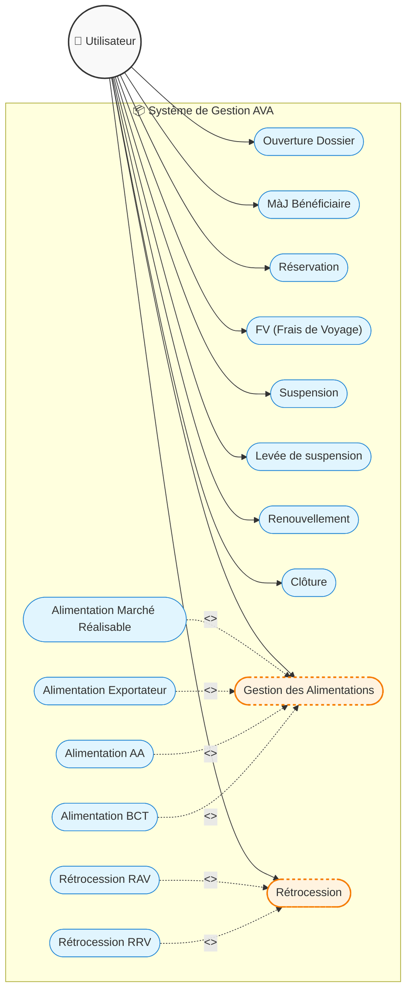

# Cas d'Utilisation - Système AVA (Diagramme)

Ce document fournit les prompts et les codes sources nécessaires pour générer les diagrammes de cas d'utilisation du système de gestion des dossiers AVA.
Il englobe toutes les opérations métier définies dans la documentation du projet (Ouverture, Alimentations diverses, Bénéficiaires, Suspsensions, Rétrocessions, Réservations, etc.).

---

## 1. Prompt Générique pour l'IA (Eraser AI, ChatGPT, Claude)
*Copiez-collez ce texte dans votre outil IA de prédilection pour initier ou modifier la génération du diagramme textuellement.*

```text
Génère-moi un diagramme de cas d'utilisation pour une application bancaire (Système AVA) qui gère les dossiers d'allocation de devises.

### Acteur(s) :
- Utilisateur (Agent Bancaire ou Système) : C'est le seul acteur principal qui interagit avec le système pour déclencher les opérations.

### Cas d'Utilisation (Opérations) :
L'acteur principal peut effectuer les opérations suivantes sur un dossier AVA :
1. "Ouverture d'un dossier"
2. "Mise à jour d'un bénéficiaire" (Lié aux règles Beneficiaire)
3. "Réservation"
4. "Générer les Frais de Voyage (FV)"
5. "Gérer les Alimentations" (Opération générique), avec les spécialisations suivantes (relation UML d'extension ou d'héritage) :
    - "Alimentation Marché Réalisable"
    - "Alimentation Exportateur"
    - "Alimentation AA"
    - "Alimentation BCT"
6. "Gérer les Rétrocessions" (Opération générique), avec les spécialisations suivantes :
    - "Rétrocession RAV"
    - "Rétrocession RRV"
7. "Suspendre un dossier" (Suspension)
8. "Lever la suspension d'un dossier" (Levée de suspension)
9. "Renouvellement d'un dossier"
10. "Clôture du dossier"

### Contraintes de styles :
- Place tous les cas d'utilisation dans une boîte de délimitation (System Boundary) nommée "Système de Gestion AVA".
- L'acteur est à l'extérieur, connecté aux fonctionnalités principales.
- Fais en sorte de relier les sous-menus "Alimentation" et "Rétrocession" de manière hiérarchique avec la mention "<<extends>>".
```

---

## 2. Code Mermaid.js
*Aperçu directement disponible dans un visualiseur Markdown compatible ou éditeur Mermaid.*



---

## 3. Code Eraser.io
*Copiez le bloc de code suivant et collez-le directement dans l'interface de diagramme "as code" sur [Eraser.io](https://app.eraser.io).*

```eraser
// Acteur principal
User [shape: actor, icon: user, label: "Utilisateur"]

// Limite et modules du système AVA
Systeme AVA [shape: group] {
    Ouverture [shape: oval, label: "Ouverture Dossier"]
    MAJ_Beneficiaire [shape: oval, label: "MàJ Bénéficiaire"]
    Reservation [shape: oval, label: "Réservation"]
    FV [shape: oval, label: "Générer FV"]
    Suspension [shape: oval, label: "Suspension"]
    Levee [shape: oval, label: "Levée de suspension"]
    Renouvellement [shape: oval, label: "Renouvellement"]
    Cloture [shape: oval, label: "Clôture"]

    // Modules contenant des sous-types (Extends)
    Alimentation [shape: oval, label: "Alimentation", color: blue]
    Alimentation_MR [shape: oval, label: "Alim. Marché Réalisable"]
    Alimentation_Exp [shape: oval, label: "Alim. Exportateur"]
    Alimentation_AA [shape: oval, label: "Alim. AA"]
    Alimentation_BCT [shape: oval, label: "Alim. BCT"]

    Retrocession [shape: oval, label: "Rétrocession", color: orange]
    Retrocession_RAV [shape: oval, label: "Rétrocession RAV"]
    Retrocession_RRV [shape: oval, label: "Rétrocession RRV"]
}

// Associations principales
User > Ouverture
User > MAJ_Beneficiaire
User > Reservation
User > Alimentation
User > Retrocession
User > FV
User > Suspension
User > Levee
User > Renouvellement
User > Cloture

// Extensions pour les Alimentations
Alimentation_MR > Alimentation : extends [style: dashed]
Alimentation_Exp > Alimentation : extends [style: dashed]
Alimentation_AA > Alimentation : extends [style: dashed]
Alimentation_BCT > Alimentation : extends [style: dashed]

// Extensions pour les Rétrocessions
Retrocession_RAV > Retrocession : extends [style: dashed]
Retrocession_RRV > Retrocession : extends [style: dashed]
```
