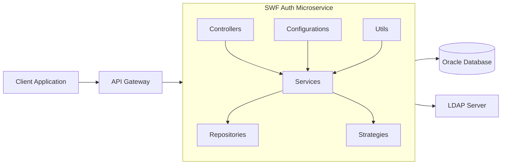
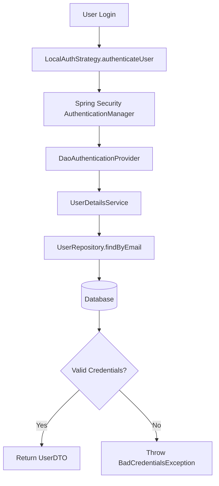
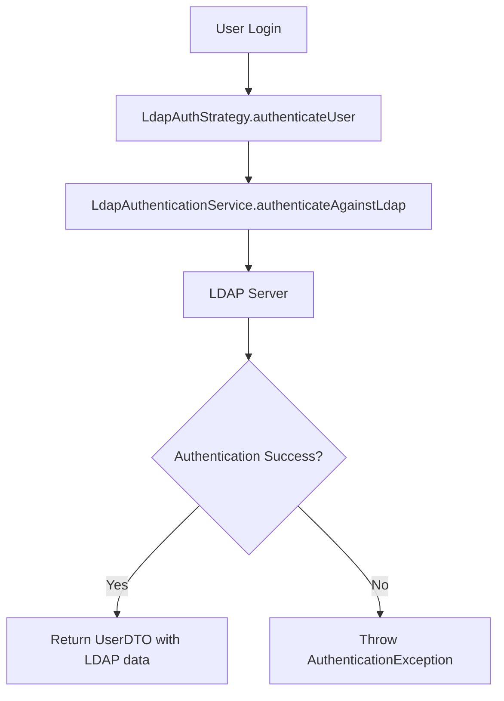
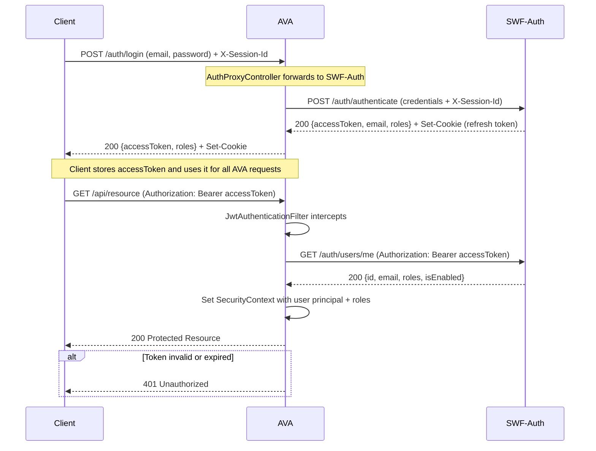
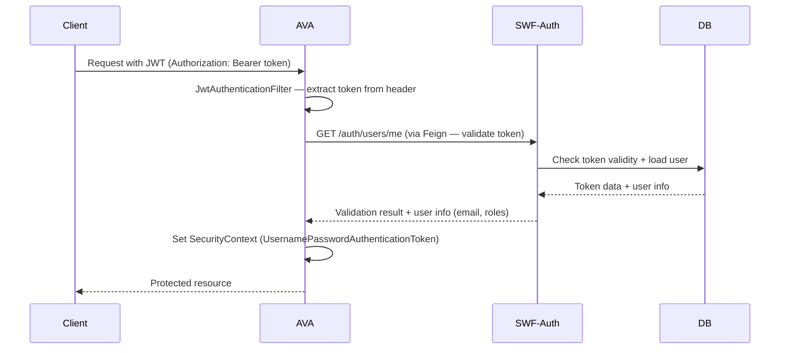
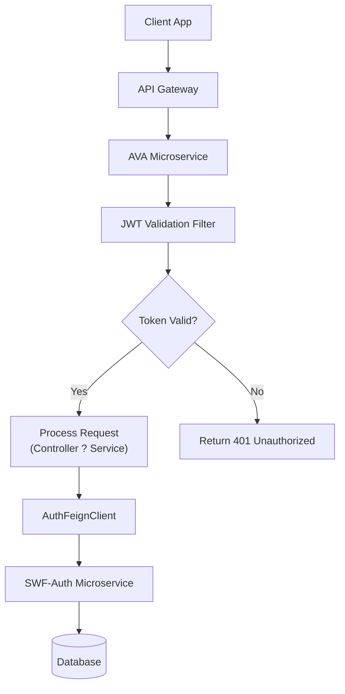
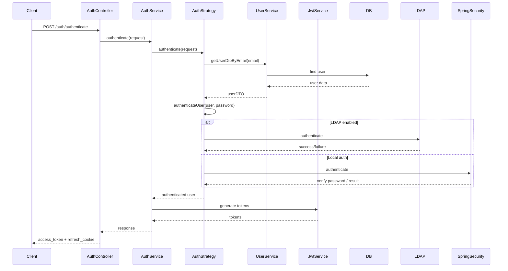

# Auth Integration Guide — AVA ? SWF-Auth

## Purpose

This document describes how **AVA** delegates authentication and session management to the **SWF-Auth** microservice (`http://localhost:8081`). It covers the full architecture, Mermaid diagrams, implementation details, and the Copilot prompt to regenerate the integration code.

---

## High-Level Goals

- Keep the microservices architecture — **do not** recreate auth logic inside AVA.
- All login / registration / refresh / logout flows execute inside **SWF-Auth**.
- AVA acts as a **protected resource** that validates tokens by calling SWF-Auth via Feign.
- Secrets and base URLs are stored in `application.properties` / env vars.

---

## Component Responsibilities

| Component | Role |
|-----------|------|
| **SWF-Auth** | Issues JWTs, stores users + roles in Oracle DB, optionally authenticates via LDAP |
| **AVA** | Protected resource; forwards credentials to SWF-Auth; validates tokens via Feign before serving requests |
| **Client App** | Calls AVA (or SWF-Auth directly) to authenticate, then uses Bearer token for all AVA API calls |

---

## Architecture Overview (SWF-Auth internals)



---

## Local Auth Strategy Flow (inside SWF-Auth)



---

## LDAP Auth Strategy Flow (inside SWF-Auth)



---

## AVA + SWF-Auth Login Sequence



---

## JWT Validation via Feign (AVA token guard)



---

## Microservice Integration Pattern (AVA side)



---

## Full SWF-Auth Authentication Sequence (internal detail)



---

## Sample cURL Calls

### Register

```bash
curl -X POST "http://localhost:8081/auth/register" \
  -H "Content-Type: application/json" \
  -d '{
    "firstName": "John",
    "lastName": "Doe",
    "email": "john.doe@example.com",
    "password": "password123",
    "sessionId": "session-123",
    "roles": []
  }'
```

### Authenticate via SWF-Auth (direct)

```bash
curl -v -X POST "http://localhost:8081/auth/authenticate" \
  -H "Content-Type: application/json" \
  -H "X-Session-Id: session-123" \
  -d '{"email":"john.doe@example.com","password":"password123"}'
```

### Authenticate via AVA proxy (recommended)

```bash
curl -X POST "http://localhost:8080/auth/login" \
  -H "Content-Type: application/json" \
  -H "X-Session-Id: session-123" \
  -d '{"email":"john.doe@example.com","password":"password123"}'
```

### Call a protected AVA endpoint with the token

```bash
curl -X GET "http://localhost:8080/api/dossiers" \
  -H "Authorization: Bearer <ACCESS_TOKEN>"
```

### Refresh token

```bash
curl -X POST "http://localhost:8080/auth/refresh" \
  -H "X-Session-Id: session-123" \
  -H "Cookie: <HASHED_SESSION_ID>=<REFRESH_TOKEN>"
```

---

## Implemented Files (AVA1)

| File | Purpose |
|------|---------|
| `security/client/AuthFeignClient.java` | Feign interface — calls SWF-Auth for validation, login, register, refresh |
| `security/filter/JwtAuthenticationFilter.java` | `OncePerRequestFilter` — validates Bearer token via Feign, sets SecurityContext |
| `security/config/SecurityConfig.java` | Spring Security config — stateless, public paths, adds JWT filter |
| `security/controller/AuthProxyController.java` | Thin proxy — `POST /auth/login`, `POST /auth/register`, `POST /auth/refresh` |
| `security/dto/AuthRequest.java` | Login request DTO (email, password) |
| `security/dto/AuthResponse.java` | Auth response DTO (email, accessToken, roles) |
| `security/dto/RegisterRequest.java` | Registration request DTO |
| `security/dto/UserValidationResponse.java` | User info returned by SWF-Auth `/auth/users/me` |
| `security/exception/FeignAuthErrorDecoder.java` | Maps Feign 401/403 from SWF-Auth to proper Spring `ResponseStatusException` |

---

## Configuration (application.properties)

```properties
# SWF-Auth microservice base URL
api.swf-auth.base-url=http://localhost:8081
auth.base-url=${api.swf-auth.base-url}
```

---

## Security Checklist

- [x] AVA does NOT validate JWT secrets locally — delegates to SWF-Auth (single source of truth)
- [x] Stateless session (no server-side HTTP session)
- [x] CSRF disabled (REST API)
- [x] Refresh tokens are HTTP-only cookies managed exclusively by SWF-Auth
- [x] Token validation failure logs the error but does NOT expose token details
- [ ] Switch to HTTPS between services in production
- [ ] Use a service registry (Eureka) so `auth.base-url` resolves dynamically
- [ ] Rate-limit `/auth/login` and `/auth/register` proxy endpoints

---

## Copilot Prompt — Regenerate AVA Integration Code

Paste the following prompt into GitHub Copilot Chat to regenerate the integration code from scratch:

> You are an experienced Spring Boot 3.2 developer. The **AVA** microservice (package `IbansysPoc.AVA`, port 8080) must delegate all authentication to an existing **SWF-Auth** microservice at `${auth.base-url}` (default `http://localhost:8081`).
>
> **Do NOT recreate auth logic inside AVA.** Implement the following:
>
> 1. **`AuthFeignClient`** (`security/client/`) — Feign interface that calls:
>    - `GET /auth/users/me` with `Authorization: Bearer <token>` ? returns `UserValidationResponse`
>    - `POST /auth/authenticate` with `X-Session-Id` header ? returns `AuthResponse`
>    - `POST /auth/register` ? returns `AuthResponse`
>    - `GET /auth/refresh-token` with `X-Session-Id` + `Cookie` ? returns `AuthResponse`
>
> 2. **`JwtAuthenticationFilter`** (`security/filter/`) — `OncePerRequestFilter` that:
>    - Extracts `Authorization: Bearer <token>` header
>    - Calls `AuthFeignClient.validateToken(bearerToken)` to validate via SWF-Auth
>    - On success: creates `UsernamePasswordAuthenticationToken` with `ROLE_<role>` authorities and sets `SecurityContextHolder`
>    - On failure: logs warning, does not set authentication (SecurityConfig returns 401)
>
> 3. **`SecurityConfig`** (`security/config/`) — Spring Security config:
>    - Stateless (`STATELESS` session policy), CSRF disabled
>    - Public: `/auth/login`, `/auth/register`, `/auth/refresh`, `/actuator/health`, `/swagger-ui/**`, `/v3/api-docs/**`
>    - All other routes: `.authenticated()`
>    - Adds `JwtAuthenticationFilter` before `UsernamePasswordAuthenticationFilter`
>    - Enables `@PreAuthorize` with `@EnableMethodSecurity`
>
> 4. **`AuthProxyController`** (`security/controller/`) — thin proxy:
>    - `POST /auth/register`, `POST /auth/login`, `POST /auth/refresh`
>
> 5. **`FeignAuthErrorDecoder`** — maps SWF-Auth 401 ? `UNAUTHORIZED`, 403 ? `FORBIDDEN`
>
> 6. **DTOs** with Lombok `@Data`: `AuthRequest`, `AuthResponse`, `RegisterRequest`, `UserValidationResponse`
>
> **pom.xml**: add `spring-boot-starter-security` + `spring-cloud-starter-openfeign` with Spring Cloud BOM `2023.0.1` in `<dependencyManagement>`
>
> **`AvaApplication.java`**: add `@EnableFeignClients(basePackages = "IbansysPoc.AVA.security.client")`
>
> **`application.properties`**: add `auth.base-url=${api.swf-auth.base-url}`

---

## Next Steps

1. **Build** — `cd AVA1 && mvn clean install` to verify compilation.
2. **Start both services** — SWF-Auth on `:8081`, AVA on `:8080`.
3. **Register**: `POST http://localhost:8080/auth/register`
4. **Login**: `POST http://localhost:8080/auth/login` ? copy `accessToken`
5. **Call protected AVA endpoint**: `GET http://localhost:8080/api/...` with `Authorization: Bearer <token>`
6. **Add `@PreAuthorize`** on AVA service methods that require specific roles:
   ```java
   @PreAuthorize("hasRole('ADMIN_METIER')")
   public DossierDTO createDossier(...) { ... }
   ```
