# Class diagram (Mermaid)

Paste the block below into a Mermaid renderer (Markdown preview with Mermaid enabled) to visualize the entity class diagram.

```mermaid
classDiagram

    %% Entities and attributes
    class OperationsDeleguee {
      Integer numDossier
      Short codeTypeDosAva
      LocalDate dateDossier
      Short codeAgenceAva
      Short typePieceClient
      String noPieceClient
      String numeroCompte
      String tel
      Integer codeActivite
      Integer codeSousActivite
      String declarationFiscale
      LocalDate dateUltDeclCaf
      Integer codeBanqueProvenance
      BigDecimal mntAvance
      BigDecimal mntUtilise
      BigDecimal mntAutoriseBct
      BigDecimal mntBlocage
      BigDecimal mntReserve
      BigDecimal mntAutorise
      BigDecimal solde
      BigDecimal mntCa
      BigDecimal mntCaFiscal
      Long mntImportation
      Integer numeroBct
      LocalDate dateBct
      LocalDate echeance
      Short annee
      Integer dernierNumMvtAva
      String etatDossier
      Short codeEtat
      LocalDate dateEtat
      String motifEtat
    }

    class Beneficiaire {
      BeneficiaireId id
      Short codeTypeDos
      Long codeAgenceAva
      String nomBenef
      String adresseBenef
      String qualite
      LocalDate datePiece
      String etat
      LocalDate dateCreation
      LocalDate dateSuppression
    }

    class Document {
      Long numLigne
      Short codeProduitService
      Integer codeOperation
      Long refOperation
      LocalDate dateOperation
      Long typeDocument
      Integer numDossier
      LocalDate dateDossier
      String referenceFichierJoint
      String extention
      String pathAnnee
      String pathMois
    }

    class AvaMarche {
      Integer numDossier
      String numMarche
      Long montantMarche
      String refContrat
      LocalDate dateContrat
      String contractant
      LocalDate dateDossier
      Short codeAgenceAva
      String status
      LocalDate dateFin
      Short codeDevise
      Long mntDevise
    }

    class AvaActivite {
      Integer codeActivite
      String libActivite
    }

    class AvaMarcheMvt {
      AvaMarcheMvtId id
      Long montantMarche
      String refContrat
      LocalDate dateContrat
      String contractant
      Integer numDossier
      LocalDate dateDossier
      Short codeAgenceAva
      String status
      LocalDate dateFin
      Short codeDevise
      Long mntDevise
    }
    class OperationsDelegueesMvt {
      OperationsDelegueesMvtId id
      Short codeProduitService
      Integer codeOperation
      Short codeTypeDosAva
      Integer numDossier
      LocalDate dateDossier
      Short codeAgenceAva
      Integer typePieceClient
      String noPieceClient
      String numeroCompte
      String tel
      Integer codeActivite
      Integer codeSousActivite
      String declarationFiscale
      LocalDate dateUltDeclCaf
      Integer codeBanqueProvenance
      BigDecimal mntAvance
      BigDecimal mntMvtAva
      BigDecimal mntUtilise
      BigDecimal mntAutorise
      BigDecimal solde
      BigDecimal mntCa
      BigDecimal mntCaFiscal
      Long mntImportation
      Integer numeroBct
      LocalDate dateBct
      LocalDate echeance
      Short annee
      Integer NumMvtAva
      String etatDossier
      Short codeEtat
      LocalDate dateEtat
      String motifEtat
      String status
      LocalDate dateValidation
      BigDecimal mntAutoriseBct
      BigDecimal mntBlocage
      String origine
      String referenceRes
      BigDecimal mntReserve
    }

   

    class BeneficiairesMvt {
      BeneficiairesMvtId id
      Short codeTypeDos
      Short codeAgenceAva
      String nomBenef
      String adresseBenef
      String qualite
      LocalDate datePiece
      String etat
      LocalDate dateCreation
      LocalDate dateSuppression
    }

 

    class Reservation {
      String referenceRes
      Long numeroDossier
      LocalDate dateResa
      String origine
      BigDecimal mntUtilise
      BigDecimal mntReserve
      BigDecimal mntAnnulation
    }

    class OperationrAVA {
      Long numId
      Integer codeBanqueProvenance
      Integer codeDevise
      Long numDosRap
      Integer codeOperation
      Integer codeTache
      String libTache
      LocalDate dateDosRap
      Integer codeProduitService
      Integer codeService
      String codeTypeMvtAva
      String typeDosRap
      LocalDate dateOperation
      LocalDate dateTraitement
      Integer flagTraitement
      BigDecimal mntMvtDvs
      BigDecimal mntMvtTnd
      BigDecimal coursAchat
      BigDecimal coursSpecial
      LocalDate dateJournee
      String noCompte
      Integer typePieceBenef
      String noPieceBenef
      Long numDossierAva
      Long refOperation
      String sens
      LocalDateTime dateInsertion
    }


    %% Relationships (multiplicities derived from JPA mappings)
    OperationsDeleguee "1" o-- "0..*" Beneficiaire : beneficiaires
    OperationsDeleguee "1" o-- "0..*" Document : documents
    OperationsDeleguee "1" o-- "0..1" AvaMarche : avaMarche
    OperationsDeleguee "1" o-- "0..1" OperationrAVA : operationAva


    Beneficiaire "*" -- "1" OperationsDeleguee : operationsDeleguee
    Document "*" -- "1" OperationsDeleguee : operationsDeleguee

    OperationsDelegueesMvt "1" o-- "0..*" BeneficiairesMvt : beneficiairesMvtListe
    OperationsDelegueesMvt "1" o-- "0..*" Document : documents
    OperationsDelegueesMvt "1" o-- "0..1" AvaMarcheMvt : avaMarcheMvt

    BeneficiairesMvt "*" -- "1" OperationsDelegueesMvt : operationsDelegueesMvt
    Document "*" -- "1" OperationsDelegueesMvt : operationsDelegueesMvt

    AvaMarcheMvt "1" -- "1" OperationsDelegueesMvt : join(refOperation,dateOperation)
    AvaMarche "1" -- "1" OperationsDeleguee : join(NUM_DOSSIER)

    Reservation "1" o-- "0..*" OperationsDelegueesMvt : operationsDelegueesMvts


   
    %% Simple entities without direct relationships
    AvaActivite -- OperationsDeleguee : referenced by codeActivite (fk)

    %% Notes
    %% - join(...) indicates composite join columns used in JPA (@JoinColumns)
    %% - multiplicities shown as JPA mapping interpretation (OneToMany = 1..* / 0..*)

```

Rendered diagram will show entities with attributes and the main JPA relationships (OneToOne, OneToMany, ManyToOne). Use a Mermaid-capable viewer to visualize.
