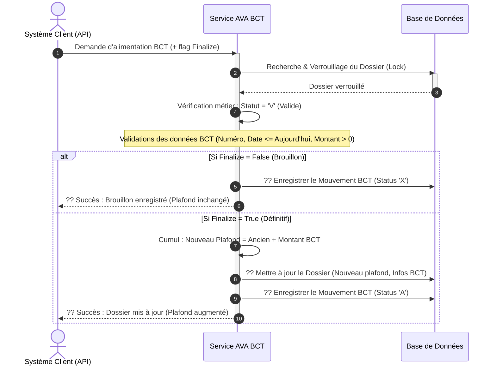

# Diagramme de Séquence Simplifié - Opération "Alimentation Suite Accord BCT"

Ce document décrit de manière simplifiée et visuelle le processus d'Alimentation suite à un Accord de la Banque Centrale de Tunisie (BCT). Il masque la complexité technique pour offrir une lecture fluide orientée métier.

---

## 1. Prompt Générique pour l'IA

```text
Génère un diagramme de séquence UML de haut niveau pour présenter le processus métier "Alimentation Suite Accord BCT" dans le système AVA.

### Acteurs et Composants :
1. "Système Client / API" (Déclencheur qui soumet le numéro de dossier et les données de l'accord BCT par DTO)
2. "Service AVA BCT" (Moteur de traitement gérant la logique d'alimentation et l'accumulation du plafond)
3. "Base de Données" (Stockage du dossier et de ses mouvements, avec gestion de verrouillage)

### Workflow métier :
1. Le "Système Client" envoie une demande d'alimentation (fournissant le `numDossier` dans l'URL et l'accord BCT via DTO) avec un indicateur Finalize (True/False).
2. Le "Service AVA BCT" recherche et verrouille (lock pessimiste) le Dossier dans la "Base de Données".
   - Si introuvable : Erreur (ResourceNotFound).
3. Le "Service AVA BCT" vérifie que le statut du dossier est Valide ('V').
   - Si statut bloqué ('B') ou autre : Erreur métier.
4. Validation des données BCT : `numeroBct` fourni, `dateBct` (passée ou d'aujourd'hui), `mntMvtAva` strictement positif.
5. Gestion selon le flag Finalize :
   - Boucle Alternative (Si Finalize = False / Mode Brouillon) :
     - Le "Service AVA BCT" enregistre un simple mouvement d'attente (Status 'X') dans la "Base de Données".
     - Le "Service AVA BCT" retourne un accusé de réception sans impacter les soldes.
   - Boucle Alternative (Si Finalize = True / Mode Définitif) :
     - Le "Service AVA BCT" cumule le nouveau montant avec l'ancien (nouveau Plafond = plafond actuel + montant accordé).
     - Le "Service AVA BCT" met à jour le Dossier (mise à jour des infos BCT et du nouveau Plafond Autorisé).
     - Le "Service AVA BCT" enregistre un Mouvement définitif (Status 'A').
     - Le "Service AVA BCT" retourne le Dossier complet (avec ses nouveaux plafonds) au "Système Client".
```

---

## 2. Code Mermaid.js



---

## 3. Code Eraser.io

```eraser
Client / API > Service AVA BCT: Demande d'Alimentation BCT
activate Service AVA BCT

Service AVA BCT > Base de Données: Récupérer & Verrouiller Dossier
Base de Données > Service AVA BCT: Infos Dossier

Service AVA BCT > Service AVA BCT: Vérifier si Dossier est Valide (V)
Service AVA BCT > Service AVA BCT: Valider format DTO BCT (Montant > 0, Date OK)

alt Mode Brouillon (Finalize = False)
    Service AVA BCT > Base de Données: ?? Sauvegarder Opération en attente (X)
    Service AVA BCT > Client / API: ?? Accusé de réception (Brouillon)
else Mode Définitif (Finalize = True)
    Service AVA BCT > Service AVA BCT: Calculer le cumul (Nouveau Plafond BCT)
    Service AVA BCT > Base de Données: ?? Maj Dossier (Nouveau plafond cumulé, N° BCT)
    Service AVA BCT > Base de Données: ?? Sauvegarder Opération validée (A)
    
    Service AVA BCT > Client / API: ?? Succès (Plafond augmenté avec succès)
end

deactivate Service AVA BCT
```
