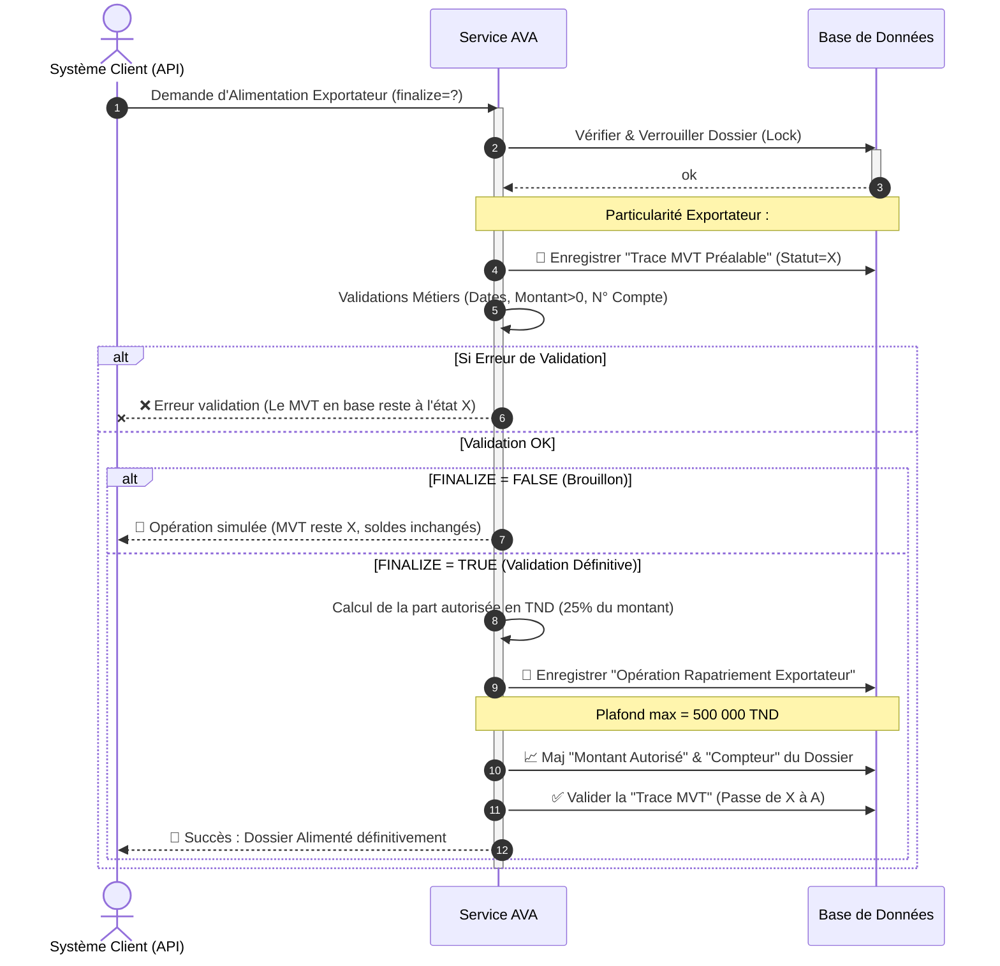

# Diagramme de Séquence Simplifié - Opération "Alimentation Exportateur" (Rapatriement)

Ce document décrit de manière simplifiée et visuelle le processus métier d'un Rapatriement Exportateur dans le système AVA. Il masque la complexité technique pour une communication fluide avec les parties prenantes.

---

## 1. Prompt Générique pour l'IA

```text
Génère un diagramme de séquence UML de haut niveau pour présenter le processus métier d'"Alimentation Exportateur" (Rapatriement de devises) dans le système AVA.

### Acteurs et Composants :
1. "Système Client / API" (Déclencheur)
2. "Service AVA" (Moteur de traitement métier)
3. "Base de Données" (Stockage des informations)

### Workflow métier :
1. Le "Système Client" envoie une demande d'alimentation exportateur pour un dossier précis avec un statut final (Brouillon/Finalisé = finalize).
2. Le "Service AVA" vérifie que le dossier existe et le verrouille (Lock) dans la "Base de Données".
3. **Cas particuler du Rapatriement Exportateur** : le "Service AVA" crée IMMÉDIATEMENT un mouvement "Brouillon/Erreur potentielle" (Statut=X) dans la "Base de Données" avant même de continuer.
4. Le "Service" AVA valide ensuite toutes les règles métiers (Date cohérente, Montant > 0, N° Compte valide à 13 chiffres, Pièce valide).
   - Si une erreur survient, le mouvement brouillon reste en base pour traçabilité technique, et l'API renvoie une Erreur au Client.
5. Boucle Alternative de Finalisation (SI FINALIZE = TRUE - Opération Validée) :
   - Le "Service AVA" calcule le montant autorisé en TND = (Montant Rapatrié x 25%).
   - Le "Service AVA" enregistre définitivement l'Opération Rapatriement dans la "Base de Données".
   - Le "Service AVA" augmente le "Montant Autorisé" du Dossier Parent dans la limite du plafond légal (500 000 TND max).
   - Le "Service AVA" valide le mouvement initialement créé (Passe de Statut X à Statut A).
   - Le "Service AVA" confirme le succès définitif au "Système Client".
6. Boucle Alternative (SI FINALIZE = FALSE - Simple Brouillon) :
   - Le processus s'arrête là, le mouvement reste en "Brouillon", les soldes ne sont pas modifiés.
   - Le "Service AVA" confirme le brouillon au "Client".
```

---

## 2. Code Mermaid.js



---

## 3. Code Eraser.io

```eraser
Client / API > Service AVA: Alimentation Exportateur (finalize)
activate Service AVA

Service AVA > Base de Données: 🔒 Vérifier et verrouiller dossier
Base de Données > Service AVA: Ok

// Note: MVT toujours créé en premier pour ce flux
Service AVA > Base de Données: 💾 Insérer trace MVT "Brouillon / Attente" (Status=X)

Service AVA > Service AVA: Validations (Montant>0, Compte, Dates)

alt Erreur de validation
    Service AVA > Client / API: ❌ Erreur Validation
else Valide
    alt Finalize = False (Brouillon)
        Service AVA > Client / API: 📝 Tracé en mode Brouillon
    else Finalize = True (Validation)
        Service AVA > Service AVA: Calcul du Montant (25% Rapatrié)
        Service AVA > Base de Données: 💾 Sauvegarder Opération Exportateur
        Service AVA > Base de Données: 📈 Maj Montant Autorisé Dossier (Max 500k)
        Service AVA > Base de Données: ✅ Valider la trace MVT (Status=A)

        Service AVA > Client / API: 🎉 Succès de l'Alimentation
    end
end

deactivate Service AVA
```