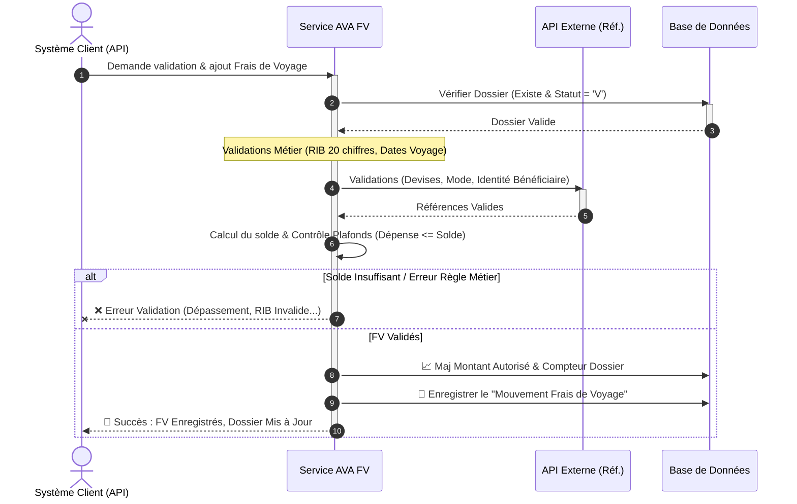

# Diagramme de Séquence Simplifié - Opération "FV" (Frais de Voyage)

Ce document décrit de manière simplifiée et visuelle le processus de validation et de persistance des Frais de Voyage (FV) dans le système AVA. Il masque la complexité technique au profit d'une lecture fluide.

---

## 1. Prompt Générique pour l'IA

```text
Génère un diagramme de séquence UML de haut niveau pour présenter le processus métier "Frais de Voyage (FV)" dans le système AVA.

### Acteurs et Composants :
1. "Système Client / API" (Déclencheur)
2. "Service AVA FV" (Moteur de traitement spécifique aux Frais de Voyage)
3. "API Externe" (Système de référence pour vérifier Devises, Modes de paiement et Identité)
4. "Base de Données" (Stockage des dossiers et de l'historique)

### Workflow métier :
1. Le "Système Client" envoie une demande de Frais de Voyage pour un Dossier spécifique.
2. Le "Service AVA FV" interroge la "Base de Données" pour s'assurer que le dossier est dans un état Valide (Statut = 'V') et récupère les données manquantes.
   - Si le dossier n'est pas valide ou introuvable : Erreur.
3. Le "Service AVA FV" déclenche la série de validations (Contrôle du RIB à 20 chiffres, validation des dates de voyage).
4. Le "Service AVA FV" interroge l'"API Externe" pour valider la Devise, le mode de paiement et l'existence du bénéficiaire.
5. Le "Service AVA FV" calcule le solde actuel du dossier (Solde = Autorisé + Avance - Utilisé) et s'assure que le montant demandé ne dépasse pas les plafonds légaux.
   - Si dépassement de plafond ou solde insuffisant : Erreur.
6. Une fois toutes les règles validées :
   - Le "Service AVA FV" met à jour le "Montant Autorisé" du dossier et incrémente le nombre de mouvements dans la "Base de Données".
   - Le "Service AVA FV" enregistre la trace détaillées de ce nouveau "Mouvement FV" dans l'historique (Base de Données).
   - Le "Service AVA FV" retourne un message de Succès avec les nouveaux soldes au "Système Client".
```

---

## 2. Code Mermaid.js



---

## 3. Code Eraser.io

```eraser
Client / API > Service AVA FV: Demande FV (Frais de Voyage)
activate Service AVA FV

Service AVA FV > Base de Données: Vérifier si Dossier est Valide (V)
Base de Données > Service AVA FV: Statut Ok

Service AVA FV > Service AVA FV: Contrôle de forme (RIB, Dates)

Service AVA FV > API Externe: Vérifier Références (Devises, Bénéficiaire)
API Externe > Service AVA FV: Identité & Réf Ok

Service AVA FV > Service AVA FV: Calcul du Solde & Contrôle Plafonds

alt Solde Insuffisant ou Erreur Métier
    Service AVA FV > Client / API: ❌ Erreur (Rejet FV)
else Validation Réussie
    Service AVA FV > Base de Données: 📈 Maj "Montant Autorisé" du Dossier parent
    Service AVA FV > Base de Données: 💾 Sauvegarder Opération FV détaillée
    
    Service AVA FV > Client / API: 🎉 Succès (Dossier mis à jour)
end

deactivate Service AVA FV
```