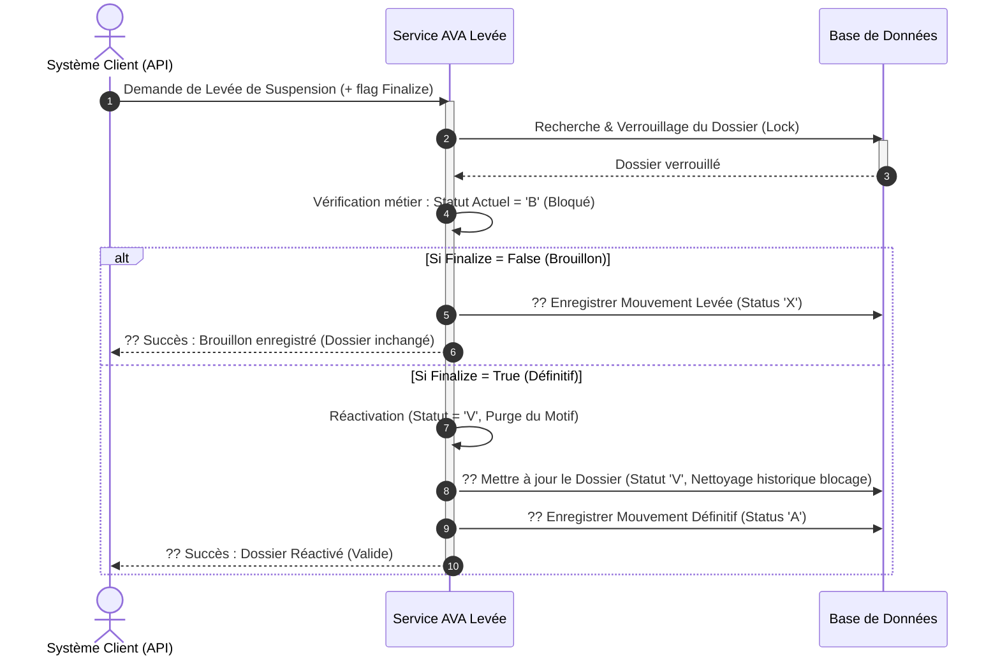

# Diagramme de Séquence Simplifié - Opération "Levée de Suspension"

Ce document décrit de manière simplifiée et visuelle le processus de Levée de Suspension (Réactivation) d'un dossier AVA. Il masque la complexité technique pour offrir une lecture fluide orientée métier.

---

## 1. Prompt Générique pour l'IA

```text
Génère un diagramme de séquence UML de haut niveau pour présenter le processus métier "Levée de Suspension" dans le système AVA.

### Acteurs et Composants :
1. "Système Client / API" (Déclencheur qui soumet le numéro de dossier à réactiver)
2. "Service AVA Levée" (Moteur de traitement gérant le déblocage)
3. "Base de Données" (Stockage du dossier et de ses mouvements, avec gestion de verrouillage)

### Workflow métier :
1. Le "Système Client" envoie une demande de Levée de suspension avec un indicateur Finalize (True/False).
2. Le "Service AVA Levée" recherche et verrouille (lock pessimiste) le Dossier dans la "Base de Données".
3. Le "Service AVA Levée" vérifie que le statut actuel est Bloqué ('B').
   - Si déjà Valide ('V') ou introuvable : Erreur.
4. Gestion selon le flag Finalize :
   - Boucle Alternative (Si Finalize = False / Mode Brouillon) :
     - Enregistrement d'un mouvement temporaire d'attente (Status 'X').
     - Le dossier reste inchangé (toujours Bloqué).
   - Boucle Alternative (Si Finalize = True / Mode Définitif) :
     - Le Dossier est réactivé : Son statut repasse à "V" (Valide), et les informations de l'ancienne suspension (motif, date) sont effacées/réinitialisées.
     - Un mouvement définitif (Status 'A') est enregistré dans l'historique.
     - Le "Service AVA Levée" retourne une confirmation de succès.
```

---

## 2. Code Mermaid.js



---

## 3. Code Eraser.io

```eraser
Client / API > Service AVA Levée: Demande Levée de Suspension
activate Service AVA Levée

Service AVA Levée > Base de Données: Récupérer & Verrouiller Dossier
Base de Données > Service AVA Levée: Infos Dossier

Service AVA Levée > Service AVA Levée: Vérifier si Dossier est Bloqué (B)

alt Mode Brouillon (Finalize = False)
    Service AVA Levée > Base de Données: ?? Sauvegarder Opération en attente (X)
    Service AVA Levée > Client / API: ?? Accusé de réception (Brouillon)
else Mode Définitif (Finalize = True)
    Service AVA Levée > Service AVA Levée: Appliquer la réactivation (Statut = V, purger motifs)
    Service AVA Levée > Base de Données: ?? Maj Dossier (Statut V, Nettoyage)
    Service AVA Levée > Base de Données: ?? Sauvegarder Opération validée (A)
    
    Service AVA Levée > Client / API: ?? Succès (Dossier réactivé et opérationnel)
end

deactivate Service AVA Levée
```
