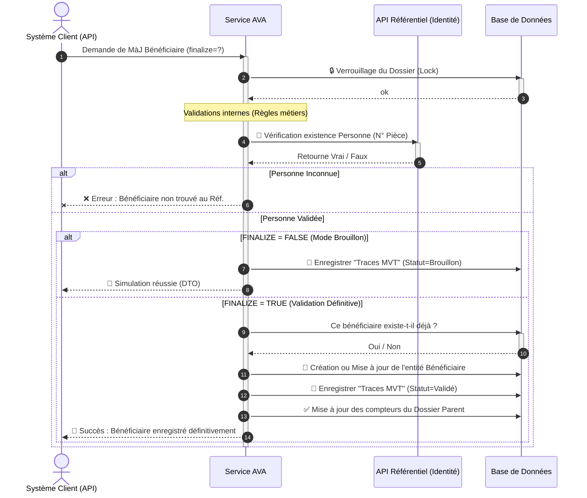

# Diagramme de Séquence Simplifié - Opération "Mise à Jour Bénéficiaire"

Ce document contient une version claire et macroscopique du processus métier lié à la création ou la mise à jour d'un Bénéficiaire dans un dossier AVA. La complexité a été abstraite pour faciliter les présentations fonctionnelles.

---

## 1. Prompt Générique pour l'IA

```text
Génère un diagramme de séquence UML de haut niveau pour présenter le processus métier de "Création / Mise à Jour d'un Bénéficiaire" dans le système AVA.

### Acteurs et Composants :
1. "Système Client / API" (Déclencheur de l'opération)
2. "Service AVA" (Orchestrateur du traitement)
3. "API Référentiel Sécurité" (Système externe de vérification d'identité)
4. "Base de Données" (Stockage des informations)

### Workflow métier :
1. Le "Système Client" envoie une demande de rattachement/mise à jour d'un Bénéficiaire sur un Dossier (avec ou sans validation définitive via le flag finalize).
2. Le "Service AVA" verrouille le "Dossier" associé dans la "Base de Données" pour éviter les conflits (Lock).
3. Le "Service AVA" valide les règles primaires (Type de pièce, statut, etc.).
4. Le "Service AVA" contacte l'"API Référentiel Sécurité" pour vérifier que la personne (Bénéficiaire) existe bien légalement.
   - Si la personne n'existe pas :
     - Le "Service AVA" retourne une Erreur Validation au "Client".
5. Le Service évalue s'il s'agit d'une simple simulation (Brouillon) ou d'une validation :
   - Boucle Alternative (SI FINALIZE = FALSE - Brouillon) :
     - Le "Service" enregistre seulement une trace/mouvement d'audit annotée "Brouillon" dans la "Base de Données".
     - Le "Service" informe le "Client" du succès de la simulation.
   - Boucle Alternative (SI FINALIZE = TRUE - Validation) :
     - Le "Service" vérifie dans la "Base de Données" si le Bénéficiaire existe déjà sur ce dossier.
     - Le "Service" Crée ou Met à jour physiquement le Bénéficiaire dans la "Base de Données".
     - Le "Service" crée une trace d'audit validée et incrémente le compteur de mouvements du "Dossier".
     - Le "Service" confirme le succès définitif au "Système Client".
```

---

## 2. Code Mermaid.js



---

## 3. Code Eraser.io

```eraser
Client / API > Service AVA: MàJ Bénéficiaire (finalize)
activate Service AVA

Service AVA > Base de Données: 🔒 Verrouiller le dossier (Lock)
Base de Données > Service AVA: Ok

Service AVA > Service AVA: Validations métiers basiques

Service AVA > API Référentiel: 🔎 Vérifier Identité (N° Pièce)
API Référentiel > Service AVA: Statut existence

alt Identité Invalide
    Service AVA > Client / API: ❌ Erreur (Personne Introuvable)
else Personne Validée
    alt Mode Brouillon (finalize = false)
        Service AVA > Base de Données: 💾 Sauvegarder trace "Brouillon"
        Service AVA > Client / API: 📝 Simulation Réussie
    else Mode Validé (finalize = true)
        Service AVA > Base de Données: 💾 Insérer / MàJ le Bénéficiaire
        Service AVA > Base de Données: 💾 Sauvegarder trace "Validée"
        Service AVA > Base de Données: ✅ MàJ compteurs du Dossier
        Service AVA > Client / API: 🎉 Succès (Opération Finalisée)
    end
end

deactivate Service AVA
```