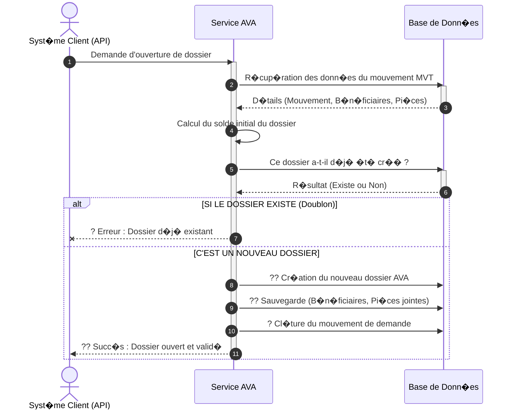

# Diagramme de S�quence Simplifi� - Op�ration "Ouverture Dossier"

Ce document contient une version claire, macroscopique et orient�e "pr�sentation" de l'op�ration d'Ouverture d'un dossier AVA. Il masque la complexit� technique au profit d'une lecture fluide pour les parties prenantes.

---

## 1. Prompt G�n�rique pour l'IA

```text
G�n�re un diagramme de s�quence UML de haut niveau pour pr�senter le processus m�tier d'"Ouverture d'un Dossier" dans le syst�me AVA. 

### Acteurs et Composants :
1. "Syst�me Client / API" (Celui qui d�clenche l'action)
2. "Service AVA" (Le c�ur du syst�me qui g�re la logique m�tier)
3. "Base de Donn�es" (L'endroit o� les informations sont stock�es)

### Workflow m�tier :
1. Le "Syst�me Client" demande l'ouverture d'un nouveau dossier (via son num�ro).
2. Le "Service" lit les informations pr�alables li�es � la demande depuis la "Base de Donn�es".
3. Le "Service" calcule le solde initial du dossier.
4. Le "Service" interroge la "Base de Donn�es" pour v�rifier si le dossier existe d�j�.
   - Boucle Alternative (SI LE DOSSIER EXISTE D�J�) :
     - Le "Service" rejette l'op�ration et retourne une Erreur "Dossier d�j� existant" au "Client".
   - Boucle Alternative (SI C'EST UN NOUVEAU DOSSIER) :
     - Le "Service" enregistre le nouveau dossier principal dans la "Base de Donn�es".
     - Le "Service" sauvegarde �galement toutes les entit�s rattach�es (B�n�ficiaires, Documents).
     - Le "Service" cl�ture le mouvement de demande initial.
     - Le "Service" confirme au "Client" que l'ouverture s'est d�roul�e avec Succ�s.
```

---

## 2. Code Mermaid.js



---

## 3. Code Eraser.io

```eraser
Client / API > Service AVA: Demande d'ouverture de dossier
activate Service AVA

Service AVA > Base de Donn�es: R�cup�rer donn�es pr�alables
Base de Donn�es > Service AVA: Infos mouvement

Service AVA > Service AVA: Calcul du solde initial

Service AVA > Base de Donn�es: V�rifier si le dossier existe
Base de Donn�es > Service AVA: Statut existence

alt Dossier d�j� existant
    Service AVA > Client / API: ? Erreur (Dossier Existant)
else Nouveau Dossier
    Service AVA > Base de Donn�es: ?? Cr�er le dossier principal
    Service AVA > Base de Donn�es: ?? Enregistrer B�n�ficiaires & Documents
    Service AVA > Base de Donn�es: ? Marquer le mouvement Trait�
    
    Service AVA > Client / API: ?? Succ�s (Dossier Ouvert)
end

deactivate Service AVA
```
