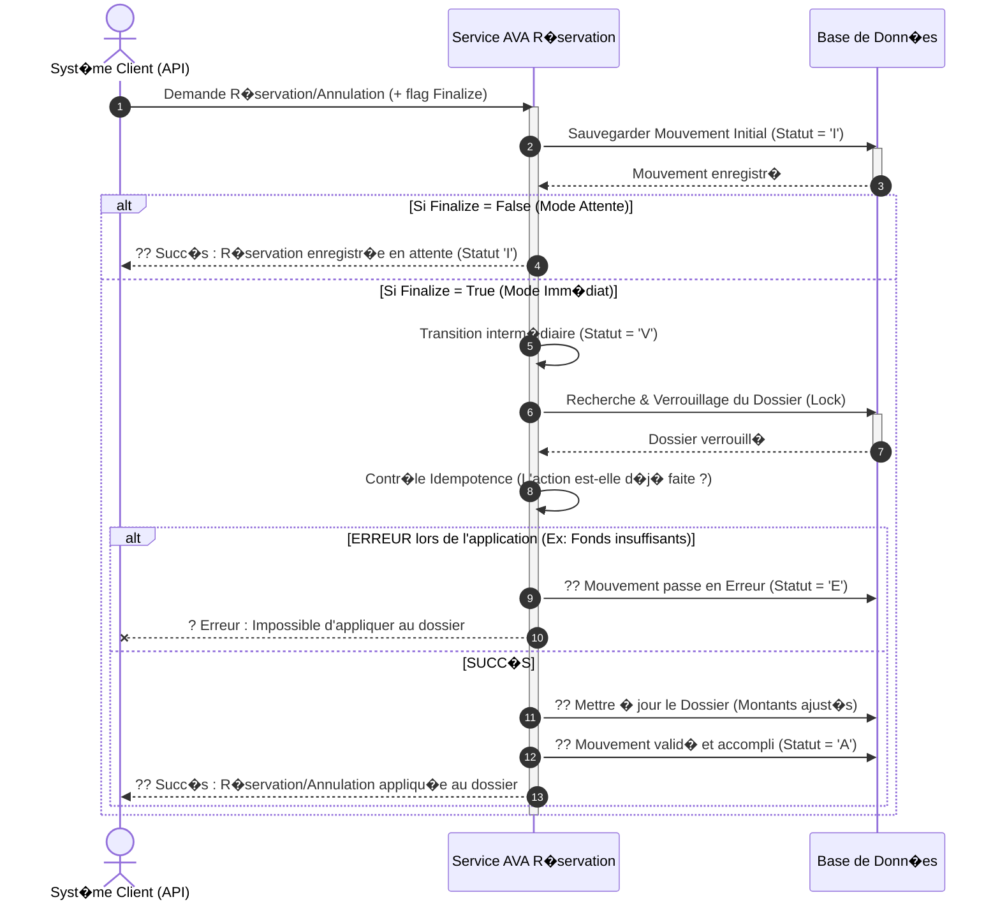

# Diagramme de S�quence Simplifi� - Op�ration "R�servation / Annulation"

Ce document d�crit de mani�re simplifi�e et visuelle le processus de cr�ation et de validation d'une R�servation (ou de son annulation) dans le syst�me AVA. Il masque la complexit� technique pour offrir une lecture fluide orient�e m�tier.

---

## 1. Prompt G�n�rique pour l'IA

```text
G�n�re un diagramme de s�quence UML de haut niveau pour pr�senter le processus m�tier "R�servation et Annulation" dans le syst�me AVA.

### Acteurs et Composants :
1. "Syst�me Client / API" (D�clencheur qui soumet le DTO de r�servation ou d'annulation)
2. "Service AVA R�servation" (Moteur de traitement g�rant le flux principal)
3. "Base de Donn�es" (Stockage des mouvements et gestion concurrente du dossier via Lock pessimiste)

### Workflow m�tier :
1. Le "Syst�me Client" envoie une demande de cr�ation (R�servation / Annulation) avec un drapeau `finalize` (True / False).
2. Le "Service AVA R�servation" r�alise une validation initiale et sauvegarde un nouveau Mouvement de R�servation � l'�tat Initial (Statut = 'I') dans la "Base de Donn�es".
3. Gestion selon le flag Finalize :
   - Boucle Alternative (Si Finalize = False / Mode Diff�r�) :
     - Le "Service AVA R�servation" retourne la r�f�rence de l'op�ration enregistr�e. Le processus s'arr�te l� (Le mouvement reste en 'I').
   - Boucle Alternative (Si Finalize = True / Mode Imm�diat) :
     - Le "Service" passe temporairement le Mouvement en �tat Valid� (Statut = 'V').
     - Le "Service" r�cup�re et verrouille (lock pessimiste) le Dossier parent dans la "Base de Donn�es" pour �viter les acc�s concurrents.
     - Le "Service" v�rifie l'idempotence (si l'action n'a pas d�j� �t� trait�e).
     - Le "Service" met � jour le Dossier (Ajustement des montants : R�servation / Annulation).
     - Si la mise � jour r�ussit, le Mouvement passe en �tat Accompli/Finalis� (Statut = 'A') dans la "Base de Donn�es".
     - Si une erreur survient durant l'application, le Mouvement passe en �tat Erreur (Statut = 'E').
     - Le "Service" retourne le r�sultat final au "Syst�me Client".
```

---

## 2. Code Mermaid.js



---

## 3. Code Eraser.io

```eraser
Client / API > Service AVA R�servation: Demande R�servation/Annulation
activate Service AVA R�servation

Service AVA R�servation > Base de Donn�es: Cr�er Mouvement stat. Initial (I)
Base de Donn�es > Service AVA R�servation: Mouvement Ok

alt Diff�r� (Finalize = False)
    Service AVA R�servation > Client / API: ?? Accus� de r�ception (Mouvement en "I")
else Imm�diat (Finalize = True)
    Service AVA R�servation > Service AVA R�servation: Passage au statut Valid� (V)
    
    Service AVA R�servation > Base de Donn�es: R�cup�rer & Verrouiller Dossier
    Base de Donn�es > Service AVA R�servation: Dossier Ok
    
    Service AVA R�servation > Service AVA R�servation: Tentative d'application (calculs)

    alt �chec / Anomalie
        Service AVA R�servation > Base de Donn�es: ?? Marquer Mouvement en Erreur (E)
        Service AVA R�servation > Client / API: ? Erreur Applicative
    else Succ�s
        Service AVA R�servation > Base de Donn�es: ?? Maj Montants du Dossier
        Service AVA R�servation > Base de Donn�es: ?? Marquer Mouvement comme Accompli (A)
        
        Service AVA R�servation > Client / API: ?? Succ�s (Dossier mis � jour)
    end
end

deactivate Service AVA R�servation
```
