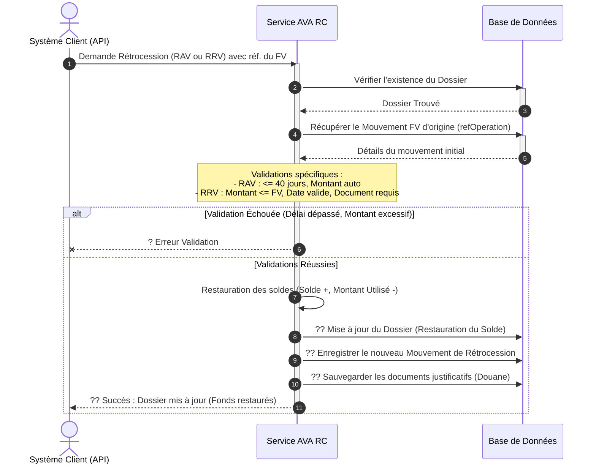

# Diagramme de Séquence Simplifié - Opération "Rétrocession (RC)"

Ce document décrit de manière simplifiée et visuelle le processus de Rétrocession (RAV : Annulation complète / RRV : Remboursement partiel) dans le système AVA. Il masque la complexité technique au profit d'une lecture fluide.

---

## 1. Prompt Générique pour l'IA

```text
Génère un diagramme de séquence UML de haut niveau pour présenter le processus métier "Rétrocession (RAV / RRV)" dans le système AVA.

### Acteurs et Composants :
1. "Système Client / API" (Déclencheur de l'annulation ou du remboursement partiel)
2. "Service AVA RC" (Moteur de traitement spécifique aux Rétrocessions)
3. "Base de Données" (Stockage des dossiers et de l'historique des mouvements)

### Workflow métier :
1. Le "Système Client" envoie une demande de Rétrocession (Type RAV ou RRV) en fournissant la référence du mouvement Frais de Voyage (FV) d'origine.
2. Le "Service AVA RC" interroge la "Base de Données" pour s'assurer que le Dossier principal existe.
3. Le "Service AVA RC" récupère le mouvement original (le FV) depuis la "Base de Données" à l'aide de la référence (refOperation).
   - S'il est introuvable : Erreur.
4. Le "Service AVA RC" exécute les validations spécifiques selon le type :
   - Pour RAV (Annulation complète) : Vérifie la règle des 40 jours (le mouvement initial doit dater de moins de 40 jours) et récupère automatiquement le montant.
   - Pour RRV (Remboursement partiel) : Vérifie que le montant demandé est inférieur ou égal au FV d'origine, valide la chronologie (date de déclaration de douane) et s'assure qu'un document justificatif est bien fourni.
5. Le "Service AVA RC" calcule les nouveaux soldes (Le montant utilisé est diminué, le solde disponible est restauré/augmenté).
   - En cas de rejets métiers (Délai dépassé, Montant invalide) : Erreur.
6. Une fois toutes les règles validées :
   - Le "Service AVA RC" met à jour le Dossier (Restauration du Solde et de la Disponibilité) dans la "Base de Données".
   - Le "Service AVA RC" enregistre le nouveau détail du "Mouvement de Rétrocession" dans l'historique.
   - Le "Service AVA RC" sauvegarde les documents justificatifs scannés (Obligatoire pour les RRV).
   - Le "Service AVA RC" retourne un message de Succès au "Système Client".
```

---

## 2. Code Mermaid.js



---

## 3. Code Eraser.io

```eraser
Client / API > Service AVA RC: Demande Rétrocession (RAV ou RRV)
activate Service AVA RC

Service AVA RC > Base de Données: Vérifier existence du Dossier
Base de Données > Service AVA RC: Dossier Ok

Service AVA RC > Base de Données: Récupérer Mouvement FV original
Base de Données > Service AVA RC: Détails Frais de Voyage (FV)

Service AVA RC > Service AVA RC: Validations RAV (Délai <40j) ou RRV (Montant <= Mvt FV, Doc)

alt Échec Validation Métier
    Service AVA RC > Client / API: ? Erreur (Délai échoué, Montant invalide)
else Validation Réussie
    Service AVA RC > Service AVA RC: Calcul de restauration (Solde +, Mnt Utilisé -)
    Service AVA RC > Base de Données: ?? Maj Dossier (Fonds restaurés)
    Service AVA RC > Base de Données: ?? Sauvegarder Opération de Rétrocession
    Service AVA RC > Base de Données: ?? Sauvegarder Documents (Déclaration RRV)
    
    Service AVA RC > Client / API: ?? Succès (Fonds récupérés avec succès)
end

deactivate Service AVA RC
```
