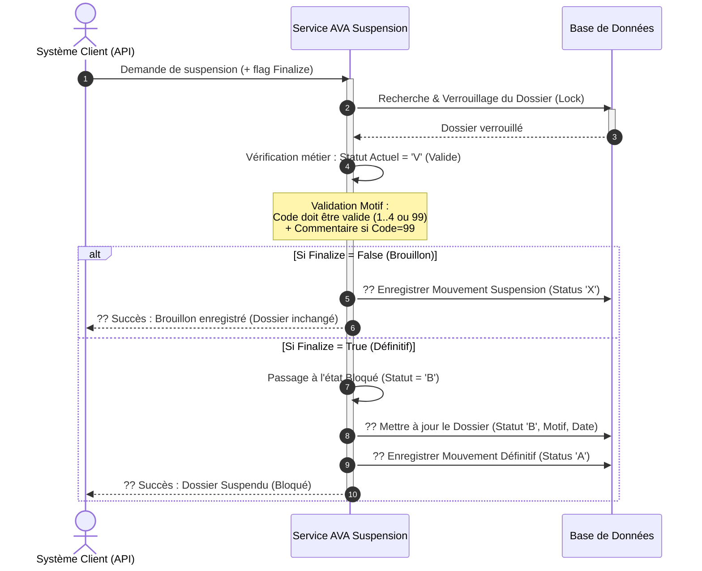

# Diagramme de Séquence Simplifié - Opération "Suspension de Dossier"

Ce document décrit de manière simplifiée et visuelle le processus de Suspension d'un dossier AVA. Il masque la complexité technique pour offrir une lecture fluide orientée métier.

---

## 1. Prompt Générique pour l'IA

```text
Génère un diagramme de séquence UML de haut niveau pour présenter le processus métier "Suspension de Dossier" dans le système AVA.

### Acteurs et Composants :
1. "Système Client / API" (Déclencheur qui soumet le DTO de suspension contenant le numéro de dossier et le motif)
2. "Service AVA Suspension" (Moteur de traitement gérant la logique de blocage)
3. "Base de Données" (Stockage du dossier et de ses mouvements, avec gestion de verrouillage)

### Workflow métier :
1. Le "Système Client" envoie une demande de suspension avec un indicateur Finalize (True/False).
2. Le "Service AVA Suspension" recherche et verrouille (lock pessimiste) le Dossier dans la "Base de Données".
3. Le "Service AVA Suspension" vérifie que le statut actuel est Valide ('V').
   - Si déjà bloqué ('B') ou introuvable : Erreur.
4. Validation du motif : le "codeEtat" doit faire partie des motifs autorisés (1, 2, 3, 4, ou 99). Si 99, une description ("motifEtat") est obligatoire.
5. Gestion selon le flag Finalize :
   - Boucle Alternative (Si Finalize = False / Mode Brouillon) :
     - Enregistrement d'un mouvement temporaire d'attente (Status 'X').
     - Le dossier reste inchangé (toujours Valide).
   - Boucle Alternative (Si Finalize = True / Mode Définitif) :
     - Le Dossier est officiellement bloqué : Son statut passe à "B" (Bloqué), avec la date du jour et le motif enregistré dans la "Base de données".
     - Un mouvement définitif (Status 'A') est enregistré dans l'historique.
     - Le "Service AVA Suspension" retourne une confirmation de succès.
```

---

## 2. Code Mermaid.js



---

## 3. Code Eraser.io

```eraser
Client / API > Service AVA Suspension: Demande de Suspension
activate Service AVA Suspension

Service AVA Suspension > Base de Données: Récupérer & Verrouiller Dossier
Base de Données > Service AVA Suspension: Infos Dossier

Service AVA Suspension > Service AVA Suspension: Vérifier si Dossier est Valide (V)
Service AVA Suspension > Service AVA Suspension: Valider le motif (Code / Description)

alt Mode Brouillon (Finalize = False)
    Service AVA Suspension > Base de Données: ?? Sauvegarder Opération en attente (X)
    Service AVA Suspension > Client / API: ?? Accusé de réception (Brouillon)
else Mode Définitif (Finalize = True)
    Service AVA Suspension > Service AVA Suspension: Appliquer le blocage (Statut = B)
    Service AVA Suspension > Base de Données: ?? Maj Dossier (Statut B, Motif renseigné)
    Service AVA Suspension > Base de Données: ?? Sauvegarder Opération validée (A)
    
    Service AVA Suspension > Client / API: ?? Succès (Dossier officiellement bloqué)
end

deactivate Service AVA Suspension
```
